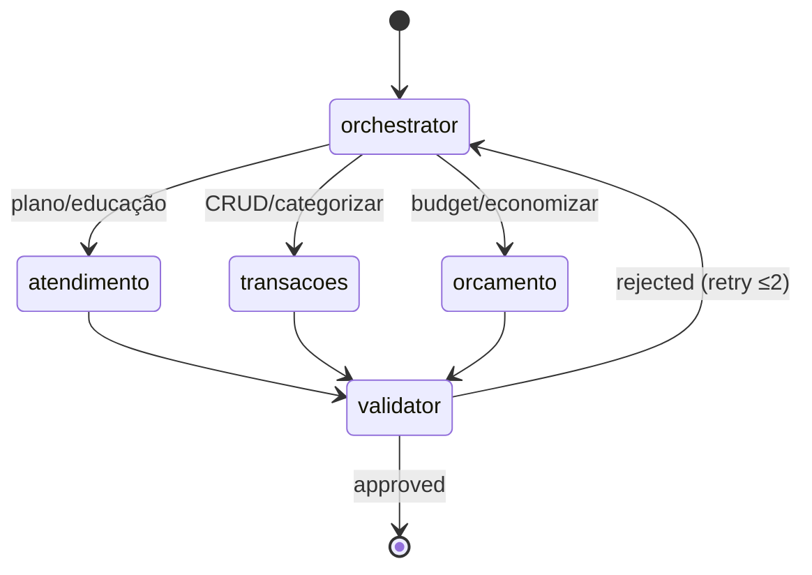

# Assistente Financeiro — Design

**Spec**: `.specs/features/financial-assistant/spec.md`
**Status**: Draft

---

## Architecture Overview

Aplicação **FastAPI** monolítica modular: camada web (auth + dashboard + chat SSE), camada de agentes (LangGraph), camada de domínio (services), persistência dual (SQLite + ChromaDB), MCPs como processos filhos.

**Abordagem escolhida:** Monolito modular Python (recomendado) — um deploy, stack unificada, MCPs como sub-processos. Alternativas descartadas: microserviços (overkill para MVP), Streamlit (limitado para auth + multi-page custom).

```mermaid
flowchart TB
    subgraph client [Browser]
        LOGIN[/login /register]
        DASH[/dashboard]
        CHAT[/chat]
    end

    subgraph api [FastAPI]
        AUTH_R[Auth Router]
        WEB_R[Web Router]
        CHAT_R[Chat Router SSE]
        DEPS[Auth Dependency user_id]
    end

    subgraph agents [LangGraph]
        ORCH[Orquestrador]
        ATD[Atendimento]
        TRN[Transações]
        ORC[Orçamento]
        VAL[Validador]
    end

    subgraph mcp [MCP Servers]
        FIN_MCP[finance-mcp]
        CHR_MCP[chroma-mcp]
    end

    subgraph data [Persistência]
        SQL[(SQLite)]
        CHR[(ChromaDB)]
    end

    LOGIN --> AUTH_R
    DASH --> WEB_R
    CHAT --> CHAT_R
    AUTH_R --> SQL
    WEB_R --> DEPS
    CHAT_R --> DEPS
    DEPS --> ORCH
    ORCH --> ATD & TRN & ORC
    ATD & TRN & ORC --> VAL
    TRN & ORC --> FIN_MCP
    ATD & TRN --> CHR_MCP
    VAL --> FIN_MCP
    FIN_MCP --> SQL
    CHR_MCP --> CHR
    FIN_MCP -.->|write-through| CHR_MCP
```

> **Nota:** `filesystem-mcp` (P2) não aparece no diagrama MVP — usado pelo agente Insights para import/export.

---

## Code Reuse Analysis

### Existing Components to Leverage

| Component | Location | How to Use |
| --------- | -------- | ---------- |
| _(greenfield)_ | — | Projeto novo — sem código existente |

### Integration Points

| System | Integration Method |
| ------ | ------------------ |
| DeepSeek API | `langchain-openai` ChatOpenAI com `base_url=https://api.deepseek.com` |
| ChromaDB | `chromadb` persistent client + LangChain `Chroma` vectorstore |
| MCP | `langchain-mcp-adapters` MultiServerMCPClient |
| Embeddings | `langchain-huggingface` HuggingFaceEmbeddings |

---

## Project Structure

```
day-04/
├── pyproject.toml
├── .env.example
├── data/                          # gitignored
│   ├── finance.db
│   └── chroma/
├── src/
│   └── financial_assistant/
│       ├── main.py                # FastAPI app factory
│       ├── config.py              # Settings pydantic-settings
│       ├── auth/
│       │   ├── router.py          # /register, /login, /logout
│       │   ├── service.py         # bcrypt + JWT
│       │   └── dependencies.py    # get_current_user
│       ├── web/
│       │   ├── router.py          # /dashboard, /chat pages
│       │   └── templates/         # Jinja2 + HTMX
│       ├── chat/
│       │   └── router.py          # POST /api/chat (SSE stream)
│       ├── agents/
│       │   ├── graph.py           # LangGraph StateGraph
│       │   ├── state.py           # AgentState TypedDict
│       │   ├── orchestrator.py
│       │   ├── specialists/       # atendimento, transacoes, orcamento
│       │   └── validator.py
│       ├── contracts/             # Pydantic models
│       │   ├── transaction.py
│       │   ├── budget.py
│       │   └── agent_response.py
│       ├── domain/
│       │   ├── models.py          # SQLAlchemy ORM
│       │   ├── repositories/
│       │   └── services/          # budget, transaction, indexing
│       ├── db/
│       │   ├── session.py
│       │   └── migrations/        # Alembic
│       └── vector/
│           ├── client.py          # ChromaDB setup
│           └── indexer.py         # write-through
├── mcp_servers/
│   ├── finance/server.py
│   └── chroma/server.py
└── tests/
    ├── unit/
    ├── integration/
    │   └── test_conversation_scenarios.py
    └── conftest.py
```

---

## Components

### Auth Service

- **Purpose**: Registro, login, JWT, isolamento por `user_id`
- **Location**: `src/financial_assistant/auth/`
- **Interfaces**:
  - `register(name, email, password) -> User`
  - `login(email, password) -> Token`
  - `get_current_user(token) -> User`
- **Dependencies**: SQLAlchemy `users` table, `passlib[bcrypt]`, `python-jose`
- **Reuses**: FastAPI dependency injection

### Dashboard Web

- **Purpose**: Página visual de transações + percentuais por categoria
- **Location**: `src/financial_assistant/web/`
- **Interfaces**:
  - `GET /dashboard` — HTML com tabela + barras de %
  - `GET /dashboard/transactions?month=&category=` — fragmento HTMX
- **Dependencies**: Auth dependency, BudgetService, TransactionRepository
- **Reuses**: Jinja2 macros para tabela e category cards

### Chat Router (SSE)

- **Purpose**: Stream de respostas do grafo LangGraph para o browser
- **Location**: `src/financial_assistant/chat/router.py`
- **Interfaces**:
  - `POST /api/chat` — body `{message, session_id}` → SSE stream
- **Dependencies**: AgentGraph, Auth dependency
- **Reuses**: LangGraph `astream_events` para tokens incrementais

### LangGraph Agent Graph

- **Purpose**: Orquestrar multi-agente com validação
- **Location**: `src/financial_assistant/agents/graph.py`
- **Interfaces**:
  - `run(user_id, session_id, message) -> AgentResponse`
- **Dependencies**: DeepSeek LLM, MCP tools, AgentState
- **Flow**:



### Roteamento de intenção (cenários reais)

| Prompt pattern | Intent | Specialist |
| -------------- | ------ | ---------- |
| "plano de gastos", "como organizar" | `explain_budget` | Atendimento |
| "qual categoria", "se encaixa" | `categorize` | Transações |
| "economizar", "prestar atenção", "orçamento" | `budget_advice` | Orçamento |
| "gastei", "recebi" | `register_transaction` | Transações |

Classificação via LLM structured output (`IntentClassification` contract) no Orquestrador.

**Regra de roteamento MVP:** um especialista por turno — fluxo fixo `orquestrador → especialista → validador`. Sem encadeamento multi-especialista no mesmo turno.

### Validator

- **Purpose**: Gate de qualidade pós-especialista
- **Location**: `src/financial_assistant/agents/validator.py`
- **Checks**:
  1. `AgentResponse` Pydantic válido
  2. Se menciona valores R$ → confere com `get_balance` / `get_budget_summary`
  3. Se menciona categoria → confere enum válido
  4. Resposta não vazia e em PT-BR

### finance-mcp

- **Purpose**: Expor CRUD financeiro via MCP
- **Location**: `mcp_servers/finance/server.py`
- **Tools**: `create_transaction`, `list_transactions`, `get_budget_summary`, `get_balance`, `update_transaction`, `delete_transaction`
- **Dependencies**: Domain services — **sempre recebe `user_id` como parâmetro obrigatório**

### chroma-mcp

- **Purpose**: Busca semântica e memória
- **Location**: `mcp_servers/chroma/server.py`
- **Tools**: `search_transactions`, `find_similar_transactions`, `query_knowledge`, `get_chat_context`, `save_working_memory`, `index_document`
- **Dependencies**: ChromaDB collections (`transactions`, `chat_memory`, `knowledge_base`, `category_examples`, `working_memory`) com filtro `user_id`
- **Fallback (VEC-05):** se ChromaDB indisponível, delegar busca textual para `TransactionRepository.search_by_description` (SQL LIKE)

### Indexer (write-through)

- **Purpose**: Sincronizar SQLite → ChromaDB
- **Location**: `src/financial_assistant/vector/indexer.py`
- **Interfaces**:
  - `index_transaction(user_id, transaction) -> None`
  - `delete_transaction_embedding(user_id, transaction_id) -> None`

---

## Data Models

### User (SQLAlchemy)

```python
class User(Base):
    id: UUID
    name: str          # max 100
    email: str         # unique, indexed
    password_hash: str
    created_at: datetime
```

### Transaction

```python
class TransactionType(str, Enum):
    INCOME = "receita"
    EXPENSE = "despesa"

class BudgetCategory(str, Enum):
    FIXED = "custos_fixos"
    COMFORT = "conforto"
    INVESTMENTS = "investimentos"
    KNOWLEDGE = "conhecimento_metas"
    PLEASURES = "prazeres"

class Transaction(Base):
    id: UUID
    user_id: UUID      # FK, indexed
    date: date
    description: str
    type: TransactionType
    amount: Decimal      # > 0
    category: BudgetCategory | None = None  # NULL para receitas; obrigatório para despesas
    created_at: datetime
```

**Validação:** `TransactionCreate` exige `category` quando `type == EXPENSE`; rejeita `category` quando `type == INCOME`.

### BudgetTarget

```python
class BudgetTarget(Base):
    id: UUID
    user_id: UUID
    category: BudgetCategory
    min_pct: float
    max_pct: float
    target_pct: float    # defaults somam 90% — margem intencional
```

### AgentState (LangGraph)

```python
class AgentState(TypedDict):
    messages: Annotated[list[BaseMessage], add_messages]
    user_id: str
    session_id: str
    intent: str | None
    retrieved_context: list[str]
    pending_action: dict | None
    agent_notes: list[str]
    last_tool_results: dict | None
    validation_attempts: int
    final_response: AgentResponse | None
```

### AgentResponse (contract)

```python
class TransactionCreate(BaseModel):
    date: date
    description: str
    type: TransactionType
    amount: Decimal          # > 0
    category: BudgetCategory | None = None

    @model_validator(mode="after")
    def validate_category_by_type(self) -> Self:
        if self.type == TransactionType.EXPENSE and self.category is None:
            raise ValueError("Despesas exigem categoria")
        if self.type == TransactionType.INCOME and self.category is not None:
            raise ValueError("Receitas não devem ter categoria")
        return self

class AgentResponse(BaseModel):
    text: str
    suggested_category: BudgetCategory | None = None
    action: Literal["none", "offer_register", "registered"] = "none"
    metadata: dict = {}
```

---

## Web Pages

| Rota | Template | Conteúdo |
| ---- | -------- | -------- |
| `/register` | `register.html` | Form nome, email, senha |
| `/login` | `login.html` | Form email, senha |
| `/dashboard` | `dashboard.html` | Tabela transações + 5 cards de % + link chat |
| `/chat` | `chat.html` | Painel chat SSE + sidebar resumo orçamento |

### Dashboard — layout

```
┌─────────────────────────────────────────────┐
│  Olá, {nome}          [Chat] [Logout]       │
├─────────────────────────────────────────────┤
│  Receita mês: R$ X    Despesas: R$ Y        │
├──────────────┬──────────────────────────────┤
│ Custos Fixos │ ████████░░ 38%  (30-40%) ✓  │
│ Conforto     │ ██████████ 22%  (15-20%) ⚠ │
│ Investimentos│ ████░░░░░░ 12%  (15-25%) ↓ │
│ Conhecimento │ ██░░░░░░░░  6%  (5-15%)  ✓  │
│ Prazeres     │ █░░░░░░░░░  3%  (≥5%)    ↓  │
├──────────────┴──────────────────────────────┤
│  Transações (filtro mês ▼ categoria ▼)     │
│  ┌──────┬────────────┬────────┬──────┬────┐ │
│  │ Data │ Descrição  │ Tipo   │ Valor│ Cat│ │
│  └──────┴────────────┴────────┴──────┴────┘ │
└─────────────────────────────────────────────┘
```

---

## Error Handling Strategy

| Error Scenario | Handling | User Impact |
| -------------- | -------- | ----------- |
| DeepSeek timeout/429 | Retry 1x; fallback mensagem amigável | "Serviço temporariamente indisponível" |
| MCP server down | Fallback in-process tools | Transparente — log warning |
| ChromaDB down | SQLite LIKE search | Busca degradada, CRUD normal |
| Validator reject | Retry specialist ≤2 | Resposta regenerada |
| Invalid auth | 401 redirect login | Redirect `/login?next=...` |
| Transaction not found (wrong user) | 404 | "Transação não encontrada" |

---

## Risks & Concerns

| Concern | Location | Impact | Mitigation |
| ------- | -------- | ------ | ---------- |
| LLM non-deterministic routing | orchestrator | Agente errado para cenário real | Intent patterns + structured output + testes dos 3 prompts |
| MCP startup latency | app boot | Slow cold start | Lazy connect + in-process fallback |
| ChromaDB model download | first run | Slow CI/dev | Cache model; document `HF_HOME` |
| JWT in cookie CSRF | auth | CSRF attack | SameSite=Lax + HTMX headers |
| User data leak via vectors | chroma | Cross-user search | Mandatory `user_id` filter em toda query |
| DeepSeek API cost in tests | integration | CI cost | Mock LLM em unit; integration com `pytest.mark.llm` optional |

---

## Tech Decisions

| Decision | Choice | Rationale |
| -------- | ------ | --------- |
| Web framework | FastAPI | Async, SSE nativo, dependency injection para auth |
| Templates | Jinja2 + HTMX | MVP rápido sem SPA; filtros dashboard sem JS pesado |
| ORM | SQLAlchemy 2.0 | Maduro, migrations Alembic |
| Auth | JWT httpOnly cookie + bcrypt | Simples, stateless, seguro o suficiente para MVP |
| Agent framework | LangGraph StateGraph | Supervisor pattern nativo, shared state |
| Embeddings | multilingual-e5-small local | Confirmado na spec |
| Test runner | pytest + pytest-asyncio | Padrão Python; markers `unit` / `integration` / `llm` |

> **Project-level:** AD-001 a AD-004 registrados em `.specs/STATE.md`.
