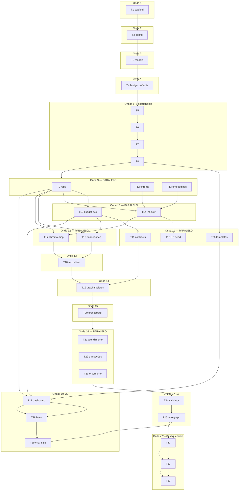

# Prompts de Execução — Assistente Financeiro

**Referências:** [spec.md](./spec.md) · [design.md](./design.md) · [tasks.md](./tasks.md)

Use este arquivo para rodar tasks no Cursor (ou outro agente). Cada prompt é **autocontido** — copie e cole em uma sessão nova.

**Regras gerais (todas as ondas):**
- Ler `spec.md` e `design.md` antes de implementar
- Um commit atômico por task (mensagem indicada em `tasks.md`)
- Rodar o verify da task antes de considerar concluída
- Gate P1: `rtk pytest tests/ -m "unit or integration" --tb=short`
- Prefixar comandos shell com `rtk` quando aplicável

---

## Mapa de ondas



| Onda | Tasks | Paralelo? | Depende de |
| ---- | ----- | --------- | ---------- |
| 1 | T1 | — | — |
| 2 | T2 | — | T1 |
| 3 | T3 | — | T2 |
| 4 | T4 | — | T3 |
| 5 | T5 | — | T4 |
| 6 | T6 | — | T5 |
| 7 | T7 | — | T6 |
| 8 | T8 | — | T7 |
| **9** | **T9, T12, T13** | **✅ 3 agentes** | T8 |
| **10** | **T10, T14** | **✅ 2 agentes** | T9 (+ T12, T13 para T14) |
| **11** | **T11, T15, T26** | **✅ 3 agentes** | T10 / T14 / T8 |
| **12** | **T16, T17** | **✅ 2 agentes** | T9+T10 / T9+T14 |
| 13 | T18 | — | T16, T17 |
| 14 | T19 | — | T11, T18 |
| 15 | T20 | — | T19 |
| **16** | **T21, T22, T23** | **✅ 3 agentes** | T20 |
| 17 | T24 | — | T21, T22, T23 |
| 18 | T25 | — | T24 |
| 19 | T27 | — | T26, T9, T10 |
| 20 | T28 | — | T27 |
| 21 | T29 | — | T25, T26 |
| 22 | T30 | — | T25 |
| 23 | T31 | — | T30 |
| 24 | T32 | — | T31 |
| **25** | **Gate final** | — | T32 |

> **Dica:** Ondas 9, 10, 11 e 16 são as melhores para abrir **múltiplas sessões Cursor em paralelo** (uma task por sessão, em branches diferentes ou sequencial com merge).

---

## Onda 1 — Scaffold

**Depende de:** nada · **Paralelo:** não

### T1 — Project scaffold

```
Execute a task T1 do Assistente Financeiro.

Contexto:
- Spec: .specs/features/financial-assistant/spec.md
- Design: .specs/features/financial-assistant/design.md
- Tasks: .specs/features/financial-assistant/tasks.md

Objetivo: criar o scaffold inicial do projeto greenfield.

Ações:
1. Criar pyproject.toml com dependências: fastapi, uvicorn, sqlalchemy, alembic, pydantic-settings, passlib[bcrypt], python-jose, langchain, langgraph, langchain-openai, chromadb, langchain-huggingface, langchain-mcp-adapters, jinja2, httpx, pytest, pytest-asyncio
2. Criar estrutura src/financial_assistant/ conforme design.md (pastas vazias com __init__.py)
3. Criar mcp_servers/finance/ e mcp_servers/chroma/
4. Criar tests/unit/, tests/integration/, conftest.py vazio
5. Criar .env.example (DATABASE_URL, CHROMA_PATH, JWT_SECRET, DEEPSEEK_API_KEY, HF_HOME)
6. Criar pytest.ini com markers: unit, integration, llm
7. Criar .gitignore (data/, .env, __pycache__, .pytest_cache, *.db)

Verify: pip install -e ".[dev]" succeeds
Commit: chore: scaffold project structure
```

---

## Onda 2 — Config

**Depende de:** T1 · **Paralelo:** não

### T2 — Config module

```
Execute a task T2 do Assistente Financeiro.

Depende de: T1 concluída (scaffold existe).

Objetivo: módulo de configuração com pydantic-settings.

Ações:
1. Implementar src/financial_assistant/config.py com Settings:
   - DATABASE_URL (default sqlite:///./data/finance.db)
   - CHROMA_PATH (default ./data/chroma)
   - JWT_SECRET, JWT_EXPIRE_MINUTES
   - DEEPSEEK_API_KEY, DEEPSEEK_BASE_URL
   - HF_HOME (opcional)
2. Singleton get_settings() com lru_cache
3. Criar tests/unit/test_config.py — carrega de env vars

Verify: rtk pytest tests/unit/test_config.py -m unit
Commit: feat: add application settings
```

---

## Onda 3 — Models

**Depende de:** T2 · **Paralelo:** não

### T3 — SQLAlchemy models + Alembic

```
Execute a task T3 do Assistente Financeiro.

Depende de: T2 (config com DATABASE_URL).

Objetivo: models ORM + migrations Alembic.

Ações:
1. src/financial_assistant/db/session.py — engine, SessionLocal, Base
2. src/financial_assistant/domain/models.py:
   - User (id UUID, name, email unique, password_hash, created_at)
   - Transaction (category NULLABLE — NULL para receitas)
   - BudgetTarget, ChatSession, ChatMessage
3. Inicializar Alembic em src/financial_assistant/db/migrations/
4. Gerar migration inicial

Regra de negócio: receitas (tipo=receita) têm category=NULL; despesas exigem category.

Verify: alembic upgrade head; tabelas existem
Commit: feat: add database models and migrations
Requirements: AUTH-01, CHAT-01, CHAT-02
```

---

## Onda 4 — Budget defaults

**Depende de:** T3 · **Paralelo:** não

### T4 — Budget category enum + seed

```
Execute a task T4 do Assistente Financeiro.

Depende de: T3 (models existem).

Objetivo: enum BudgetCategory + seed de targets padrão.

Ações:
1. BudgetCategory enum: custos_fixos, conforto, investimentos, conhecimento_metas, prazeres
2. Faixas conforme spec: Fixos 30-40%, Conforto 15-20%, Investimentos 15-25%, Conhecimento 5-15%, Prazeres ≥5%
3. Defaults target_pct: 35, 17, 20, 10, 8 (soma = 90% — margem intencional)
4. seed_budget_targets(user_id) — insere 5 BudgetTarget por usuário
5. tests/unit/test_budget_defaults.py

Verify: rtk pytest tests/unit/test_budget_defaults.py -m unit
Commit: feat: add budget categories and default targets
Requirements: BUD-01, CONV-01
```

---

## Onda 5 — Password hashing

**Depende de:** T4 · **Paralelo:** não

### T5 — Password hashing

```
Execute a task T5 do Assistente Financeiro.

Depende de: T4 (foundation completa).

Objetivo: utilitário bcrypt hash/verify.

Ações:
1. src/financial_assistant/auth/service.py:
   - hash_password(plain) -> str
   - verify_password(plain, hashed) -> bool
2. tests/unit/test_auth_service.py

Verify: rtk pytest tests/unit/test_auth_service.py -m unit
Commit: feat: add password hashing
Requirements: AUTH-01
```

---

## Onda 6 — Register

**Depende de:** T5 · **Paralelo:** não

### T6 — Register endpoint + template

```
Execute a task T6 do Assistente Financeiro.

Depende de: T5 (hashing), T3 (User model).

Objetivo: registro de usuário com template web.

Ações:
1. GET/POST /register em auth/router.py
2. Template register.html (nome, email, senha)
3. Validação: senha min 8 chars; email duplicado → "Email já cadastrado"
4. Chamar seed_budget_targets após criar usuário
5. tests/integration/test_auth.py::test_register_success

Verify: rtk pytest tests/integration/test_auth.py::test_register_success -m integration
Commit: feat: add user registration
Requirements: AUTH-01, AUTH-02
```

---

## Onda 7 — Login/logout

**Depende de:** T6 · **Paralelo:** não

### T7 — Login/logout + JWT cookie

```
Execute a task T7 do Assistente Financeiro.

Depende de: T6 (register funciona).

Objetivo: login/logout com JWT em cookie httpOnly.

Ações:
1. POST /login, POST /logout
2. Template login.html
3. JWT em cookie httpOnly, SameSite=Lax
4. Redirect para /dashboard após login
5. Credenciais inválidas → erro genérico (não revelar se email existe)
6. tests: test_login_success, test_login_invalid, test_protected_route_redirect

Verify: rtk pytest tests/integration/test_auth.py -m integration
Commit: feat: add login and session management
Requirements: AUTH-03, AUTH-04, AUTH-05
```

---

## Onda 8 — Auth dependency

**Depende de:** T7 · **Paralelo:** não

### T8 — get_current_user dependency

```
Execute a task T8 do Assistente Financeiro.

Depende de: T7 (JWT cookie funciona).

Objetivo: dependency FastAPI para rotas protegidas.

Ações:
1. auth/dependencies.py — get_current_user lê JWT do cookie
2. Redireciona para /login?next=... se não autenticado (rotas web)
3. 401 para API routes
4. test_user_isolation_in_repository — user A não vê dados de user B

Verify: rtk pytest tests/integration/test_auth.py -m integration
Commit: feat: add auth dependency for route protection
Requirements: AUTH-06

Gate parcial: rtk pytest tests/ -m "unit or integration" --tb=short
```

---

## Onda 9 — PARALELO (3 tasks)

**Depende de:** T8 · **Paralelo:** ✅ T9 ∥ T12 ∥ T13

Abra **3 sessões** (ou rode sequencialmente se preferir uma branch).

### T9 — TransactionRepository

```
Execute a task T9 do Assistente Financeiro.

Depende de: T8 (auth + models).

Objetivo: repositório CRUD de transações com isolamento por user_id.

Ações:
1. src/financial_assistant/domain/repositories/transaction_repository.py
2. Métodos: create, get_by_id, list (filtros: month, category, type), update, delete
3. search_by_description(user_id, query) — SQL LIKE para fallback VEC-05
4. Sempre filtrar por user_id; 404 se transação de outro user
5. tests/unit/test_transaction_repository.py

Verify: rtk pytest tests/unit/test_transaction_repository.py -m unit
Commit: feat: add transaction repository
Requirements: CHAT-01, TBL-01, VEC-05
```

### T12 — ChromaDB client

```
Execute a task T12 do Assistente Financeiro.

Depende de: T8 (config CHROMA_PATH).

Objetivo: client ChromaDB persistente com 5 collections.

Ações:
1. src/financial_assistant/vector/client.py
2. Collections: transactions, chat_memory, knowledge_base, category_examples, working_memory
3. Metadata schema com user_id obrigatório em todas
4. tests/unit/test_chroma_client.py

Verify: rtk pytest tests/unit/test_chroma_client.py -m unit
Commit: feat: add chromadb client
Requirements: VEC-01
```

### T13 — Embedding model loader

```
Execute a task T13 do Assistente Financeiro.

Depende de: T8 (config).

Objetivo: singleton HuggingFaceEmbeddings multilingual-e5-small.

Ações:
1. src/financial_assistant/vector/embeddings.py
2. Model: intfloat/multilingual-e5-small, device=cpu, normalize_embeddings=True
3. Teste: embedding dimension == 384

Verify: rtk pytest tests/unit/test_embeddings.py -m unit
Commit: feat: add local embedding model
Requirements: VEC-01
```

---

## Onda 10 — PARALELO (2 tasks)

**Depende de:** T9 (+ T12, T13 para T14) · **Paralelo:** ✅ T10 ∥ T14

### T10 — BudgetService

```
Execute a task T10 do Assistente Financeiro.

Depende de: T9 (TransactionRepository), T4 (BudgetTarget seed).

Objetivo: serviço de resumo de orçamento por categoria.

Ações:
1. src/financial_assistant/domain/services/budget_service.py
2. get_summary(user_id, month) → % gasto por categoria vs faixas, status ok/alerta, margem restante
3. Base de cálculo: receita total do mês; despesas por categoria
4. Aviso "sem receita base" se receita = 0
5. tests/unit/test_budget_service.py — fixture desbalanceada (Custos Fixos 50%, Prazeres 2%)

Verify: rtk pytest tests/unit/test_budget_service.py -m unit
Commit: feat: add budget summary service
Requirements: BUD-01, BUD-02, BUD-03, CONV-03
```

### T14 — Indexer write-through

```
Execute a task T14 do Assistente Financeiro.

Depende de: T9, T12, T13.

Objetivo: sincronizar SQLite → ChromaDB (write-through).

Ações:
1. src/financial_assistant/vector/indexer.py
2. index_transaction(user_id, transaction) — embedding + upsert metadata
3. delete_transaction_embedding(user_id, transaction_id)
4. Falha de embedding → log + enfileirar reindex (SQLite persiste normalmente)
5. tests/unit/test_indexer.py

Verify: rtk pytest tests/unit/test_indexer.py -m unit
Commit: feat: add write-through vector indexer
Requirements: VEC-01, VEC-04
```

---

## Onda 11 — PARALELO (3 tasks)

**Depende de:** T10 / T14 / T8 · **Paralelo:** ✅ T11 ∥ T15 ∥ T26

### T11 — Pydantic contracts

```
Execute a task T11 do Assistente Financeiro.

Depende de: T10 (BudgetSummary shapes).

Objetivo: contratos Pydantic para validação e agentes.

Ações:
1. src/financial_assistant/contracts/:
   - transaction.py — TransactionCreate (category obrigatório se despesa, proibido se receita)
   - budget.py — BudgetSummary, CategoryStatus
   - agent_response.py — AgentResponse, IntentClassification
2. tests/unit/test_contracts.py

Verify: rtk pytest tests/unit/test_contracts.py -m unit
Commit: feat: add pydantic contracts
Requirements: VAL-01, VAL-02, CHAT-02
```

### T15 — Knowledge base seed

```
Execute a task T15 do Assistente Financeiro.

Depende de: T14 (indexer funciona).

Objetivo: seed da base de conhecimento e exemplos de categorização.

Ações:
1. Docs das 5 categorias + faixas + exemplos → collection knowledge_base
2. Descrições rotuladas (mercado→custos_fixos, cinema→prazeres, etc.) → category_examples
3. Script ou fixture de seed idempotente
4. Verify: query_knowledge("custos fixos") retorna doc relevante

Verify: rtk pytest tests/unit/test_knowledge_seed.py -m unit
Commit: feat: seed budget knowledge base
Requirements: CONV-01, VEC-03
```

### T26 — Base templates + CSS

```
Execute a task T26 do Assistente Financeiro.

Depende de: T8 (auth — layout com logout).

Objetivo: templates base Jinja2 + CSS mínimo.

Ações:
1. src/financial_assistant/web/templates/base.html — layout, nav, HTMX script
2. static/css/style.css — cards de categoria, tabela, barras de progresso
3. Macro blocks para reutilização
4. Teste: template renderiza via TestClient

Verify: rtk pytest tests/integration/test_templates.py -m integration
Commit: feat: add base web templates
Requirements: WEB-01
```

---

## Onda 12 — PARALELO (2 tasks)

**Depende de:** T9+T10 (T16) / T9+T14 (T17) · **Paralelo:** ✅ T16 ∥ T17

### T16 — finance-mcp server

```
Execute a task T16 do Assistente Financeiro.

Depende de: T9, T10 (domain services).

Objetivo: servidor MCP para CRUD financeiro.

Ações:
1. mcp_servers/finance/server.py
2. Tools: create_transaction, list_transactions, get_budget_summary, get_balance, update_transaction, delete_transaction
3. Todos recebem user_id como parâmetro obrigatório
4. create_transaction → write-through ChromaDB via indexer
5. tests/integration/test_mcp.py::test_finance_create_transaction

Verify: rtk pytest tests/integration/test_mcp.py::test_finance_create_transaction -m integration
Commit: feat: add finance-mcp server
Requirements: MCP-01, MCP-02, MCP-04
```

### T17 — chroma-mcp server

```
Execute a task T17 do Assistente Financeiro.

Depende de: T9, T14 (indexer + repo fallback).

Objetivo: servidor MCP para busca semântica e memória.

Ações:
1. mcp_servers/chroma/server.py
2. Tools: search_transactions, find_similar_transactions, query_knowledge, get_chat_context, save_working_memory
3. Filtro user_id em toda query
4. Fallback VEC-05: se ChromaDB down → TransactionRepository.search_by_description
5. tests: test_chroma_search_isolation, test_chroma_fallback_sqlite_like

Verify: rtk pytest tests/integration/test_mcp.py -m integration
Commit: feat: add chroma-mcp server
Requirements: MCP-01, VEC-02, VEC-03, VEC-05
```

---

## Onda 13 — MCP client

**Depende de:** T16, T17 · **Paralelo:** não

### T18 — MCP client adapter + fallback

```
Execute a task T18 do Assistente Financeiro.

Depende de: T16, T17 (ambos MCP servers).

Objetivo: wrapper MultiServerMCPClient com fallback in-process.

Ações:
1. src/financial_assistant/mcp/client.py
2. Conectar finance-mcp e chroma-mcp via langchain-mcp-adapters
3. Se MCP falhar na inicialização → tools in-process equivalentes (log warning)
4. tests/integration: test_mcp_fallback_on_failure

Verify: rtk pytest tests/integration/test_mcp.py -m integration
Commit: feat: add mcp client with fallback
Requirements: MCP-03
```

---

## Onda 14 — Graph skeleton

**Depende de:** T11, T18 · **Paralelo:** não

### T19 — AgentState + graph skeleton

```
Execute a task T19 do Assistente Financeiro.

Depende de: T11 (contracts), T18 (MCP tools).

Objetivo: esqueleto LangGraph StateGraph.

Ações:
1. src/financial_assistant/agents/state.py — AgentState TypedDict conforme design.md
2. src/financial_assistant/agents/graph.py — StateGraph com nós orchestrator e validator (stubs)
3. Graph compila sem erro

Verify: python -c "from financial_assistant.agents.graph import build_graph; build_graph()"
Commit: feat: add langgraph skeleton
Requirements: ORCH-01
```

---

## Onda 15 — Orchestrator

**Depende de:** T19 · **Paralelo:** não

### T20 — Orchestrator intent classification

```
Execute a task T20 do Assistente Financeiro.

Depende de: T19 (graph skeleton).

Objetivo: classificação de intenção com structured output.

Ações:
1. src/financial_assistant/agents/orchestrator.py
2. IntentClassification contract — mapear patterns:
   - "plano de gastos" → explain_budget → Atendimento
   - "qual categoria"/"se encaixa" → categorize → Transações
   - "economizar"/"prestar atenção" → budget_advice → Orçamento
   - "gastei"/"recebi" → register_transaction → Transações
3. Regra MVP: 1 especialista por turno
4. tests/unit/test_orchestrator_routing.py — mock LLM

Verify: rtk pytest tests/unit/test_orchestrator_routing.py -m unit
Commit: feat: add orchestrator intent routing
Requirements: ORCH-01, ORCH-02, CONV-01/02/03
```

---

## Onda 16 — PARALELO (3 specialists)

**Depende de:** T20 · **Paralelo:** ✅ T21 ∥ T22 ∥ T23

### T21 — Specialist Atendimento

```
Execute a task T21 do Assistente Financeiro.

Depende de: T20 (orchestrator routing).

Objetivo: agente Atendimento — explica categorias e FAQ.

Ações:
1. src/financial_assistant/agents/specialists/atendimento.py
2. System prompt PT-BR; tool query_knowledge
3. Responde "Quero montar um plano de gastos" com 5 categorias + faixas + exemplos
4. Mock test: resposta contém nomes das 5 categorias

Verify: rtk pytest tests/unit/test_atendimento.py -m unit
Commit: feat: add atendimento specialist
Requirements: CONV-01
```

### T22 — Specialist Transações

```
Execute a task T22 do Assistente Financeiro.

Depende de: T20 (orchestrator routing).

Objetivo: agente Transações — CRUD e categorização.

Ações:
1. src/financial_assistant/agents/specialists/transacoes.py
2. Tools finance-mcp + find_similar_transactions
3. "Gastei 20 reais num pedido de delivery..." → Prazeres + explicação + offer_register (NÃO registrar automaticamente)
4. "Gastei R$ 150 no cinema" → cria despesa Prazeres
5. "Recebi R$ 5000 de salário" → receita com category=NULL
6. test_categorize_delivery_is_prazeres

Verify: rtk pytest tests/unit/test_transacoes.py -m unit
Commit: feat: add transacoes specialist
Requirements: CHAT-01/02/03, CONV-02
```

### T23 — Specialist Orçamento

```
Execute a task T23 do Assistente Financeiro.

Depende de: T20 (orchestrator routing).

Objetivo: agente Orçamento — alertas e recomendações.

Ações:
1. src/financial_assistant/agents/specialists/orcamento.py
2. Tool get_budget_summary
3. "Em quais categorias devo prestar atenção..." → lista categorias acima da faixa ou com menor margem
4. Sem receita no mês → orientar registrar receita primeiro (CONV-04)
5. test_budget_advice_over_budget_categories

Verify: rtk pytest tests/unit/test_orcamento.py -m unit
Commit: feat: add orcamento specialist
Requirements: BUD-03, CONV-03, CONV-04
```

---

## Onda 17 — Validator

**Depende de:** T21, T22, T23 · **Paralelo:** não

### T24 — Validator node

```
Execute a task T24 do Assistente Financeiro.

Depende de: T21, T22, T23 (specialists existem).

Objetivo: gate de qualidade pós-especialista.

Ações:
1. src/financial_assistant/agents/validator.py
2. Checks: AgentResponse Pydantic válido; valores R$ conferem com get_balance/get_budget_summary; categoria válida; PT-BR
3. Rejeição → retry specialist (max 2)
4. tests/unit/test_validator.py — rejects wrong balance

Verify: rtk pytest tests/unit/test_validator.py -m unit
Commit: feat: add response validator
Requirements: VAL-01, VAL-02, VAL-03, CONV-05
```

---

## Onda 18 — Wire graph

**Depende de:** T24 · **Paralelo:** não

### T25 — Wire full graph

```
Execute a task T25 do Assistente Financeiro.

Depende de: T24 (validator).

Objetivo: conectar todos os nós no grafo LangGraph.

Ações:
1. Atualizar graph.py — edges: orchestrator → specialist → validator → END (ou retry)
2. Max 2 validation retries
3. Persistir chat_messages no SQLite a cada turno
4. tests/integration/test_graph_smoke.py — fluxo end-to-end mockado

Verify: rtk pytest tests/integration/test_graph_smoke.py -m integration
Commit: feat: wire complete agent graph
Requirements: ORCH-01
```

---

## Onda 19 — Dashboard

**Depende de:** T26, T9, T10 · **Paralelo:** não

### T27 — Dashboard page

```
Execute a task T27 do Assistente Financeiro.

Depende de: T26 (templates), T9, T10 (dados).

Objetivo: página /dashboard com tabela + barras de %.

Ações:
1. GET /dashboard — auth required
2. Tabela transações do mês corrente (data, descrição, tipo, valor, categoria)
3. 5 cards/barras: % gasto vs faixa alvo por categoria
4. Estado vazio orientando registrar receita via chat
5. tests/integration/test_dashboard.py::test_dashboard_shows_percentages

Verify: rtk pytest tests/integration/test_dashboard.py -m integration
Commit: feat: add dashboard page
Requirements: WEB-01, WEB-02, WEB-03
```

---

## Onda 20 — HTMX filters

**Depende de:** T27 · **Paralelo:** não

### T28 — Dashboard HTMX filters

```
Execute a task T28 do Assistente Financeiro.

Depende de: T27 (dashboard base).

Objetivo: filtros HTMX sem reload completo.

Ações:
1. GET /dashboard/transactions?month=&category= — partial HTML
2. Dropdowns mês e categoria com hx-get
3. test_dashboard_filter_by_category

Verify: rtk pytest tests/integration/test_dashboard.py::test_dashboard_filter_by_category -m integration
Commit: feat: add dashboard htmx filters
Requirements: WEB-04, TBL-03
```

---

## Onda 21 — Chat SSE

**Depende de:** T25, T26 · **Paralelo:** não

### T29 — Chat page + SSE endpoint

```
Execute a task T29 do Assistente Financeiro.

Depende de: T25 (grafo completo), T26 (templates).

Objetivo: interface de chat com streaming SSE.

Ações:
1. GET /chat — página com painel chat + sidebar resumo orçamento
2. POST /api/chat — body {message, session_id} → SSE stream via graph.astream_events
3. Auth required
4. test_chat_endpoint_requires_auth

Verify: rtk pytest tests/integration/test_chat.py -m integration
Commit: feat: add chat page with sse streaming
Requirements: WEB-05, CHAT-01
```

---

## Onda 22 — Teste conversacional 1

**Depende de:** T25 · **Paralelo:** não

### T30 — Cenário plano de gastos

```
Execute a task T30 do Assistente Financeiro.

Depende de: T25 (grafo wired).

Objetivo: teste de integração — cenário real #1.

Ações:
1. tests/integration/test_conversation_scenarios.py
2. test_plano_de_gastos_explains_five_categories
3. Prompt literal: "Quero montar um plano de gastos"
4. Assert: resposta menciona 5 categorias + faixas percentuais + exemplos
5. Usar mock LLM por default; @pytest.mark.llm para DeepSeek real

Verify: rtk pytest tests/integration/test_conversation_scenarios.py::test_plano_de_gastos_explains_five_categories -m integration
Commit: test: add plano de gastos conversation scenario
Requirements: CONV-01
```

---

## Onda 23 — Teste conversacional 2

**Depende de:** T30 · **Paralelo:** não

### T31 — Cenário delivery

```
Execute a task T31 do Assistente Financeiro.

Depende de: T30.

Objetivo: teste de integração — cenário real #2.

Ações:
1. test_delivery_categorization_prazeres
2. Prompt literal: "Gastei 20 reais num pedido de delivery, em qual categoria essa despesa se encaixa?"
3. Assert: categoria Prazeres + explicação + action=offer_register (NÃO registered)

Verify: rtk pytest tests/integration/test_conversation_scenarios.py::test_delivery_categorization_prazeres -m integration
Commit: test: add delivery categorization scenario
Requirements: CONV-02
```

---

## Onda 24 — Teste conversacional 3

**Depende de:** T31 · **Paralelo:** não

### T32 — Cenário budget advice

```
Execute a task T32 do Assistente Financeiro.

Depende de: T31.

Objetivo: teste de integração — cenário real #3.

Ações:
1. test_economizar_categories_advice
2. Prompt literal: "Em quais categorias devo prestar atenção ou economizar?"
3. Fixture: receita R$ 5.000 + despesas desbalanceadas (Custos Fixos 50%, Prazeres 2%)
4. Assert: resposta menciona categorias acima da faixa

Verify: rtk pytest tests/integration/test_conversation_scenarios.py::test_economizar_categories_advice -m integration
Commit: test: add budget advice conversation scenario
Requirements: CONV-03
```

---

## Onda 25 — Gate final

**Depende de:** T32 · **Paralelo:** não

### Gate — Verificação completa P1

```
Verifique que o Assistente Financeiro MVP está completo.

Ações:
1. rtk pytest tests/ -m "unit or integration" --tb=short — deve passar 100%
2. Revisar spec.md requirement traceability — 40 requirements cobertos
3. Smoke manual (opcional):
   - Registrar usuário → login → dashboard
   - Chat: "recebi R$ 5000 de salário"
   - Chat: "gastei R$ 150 no cinema"
   - Dashboard mostra transações e percentuais
4. rtk pytest -m llm (opcional, requer DEEPSEEK_API_KEY) — cenários reais com LLM

Se falhar: corrigir antes de declarar MVP done.
```

---

## Referência rápida — máximo paralelismo

| Momento | Abrir N sessões | Tasks |
| ------- | --------------- | ----- |
| Após T8 | **3** | T9, T12, T13 |
| Após T9+T12+T13 | **2** | T10, T14 |
| Após T10+T14 | **3** | T11, T15, T26 |
| Após T10+T14 | **2** | T16, T17 |
| Após T20 | **3** | T21, T22, T23 |

**Total sequencial mínimo:** 25 ondas (se nunca paralelizar).  
**Com paralelismo máximo:** ~18 ondas (~30% mais rápido).

---

## Prompt genérico (qualquer task)

Se preferir um template único:

```
Execute a task {TX} do Assistente Financeiro.

Leia antes de codar:
- .specs/features/financial-assistant/spec.md
- .specs/features/financial-assistant/design.md
- .specs/features/financial-assistant/tasks.md (seção T{X})

Depende de: {lista de tasks anteriores concluídas}

Implemente exatamente o descrito em tasks.md para T{X}.
Rode o verify indicado. Faça um commit atômico com a mensagem indicada.
Não avance para a próxima task.
```
