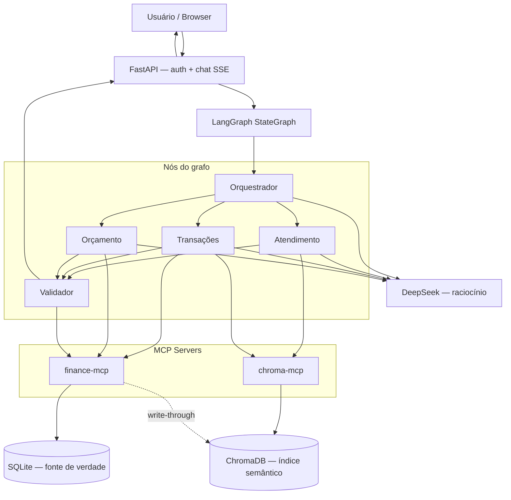
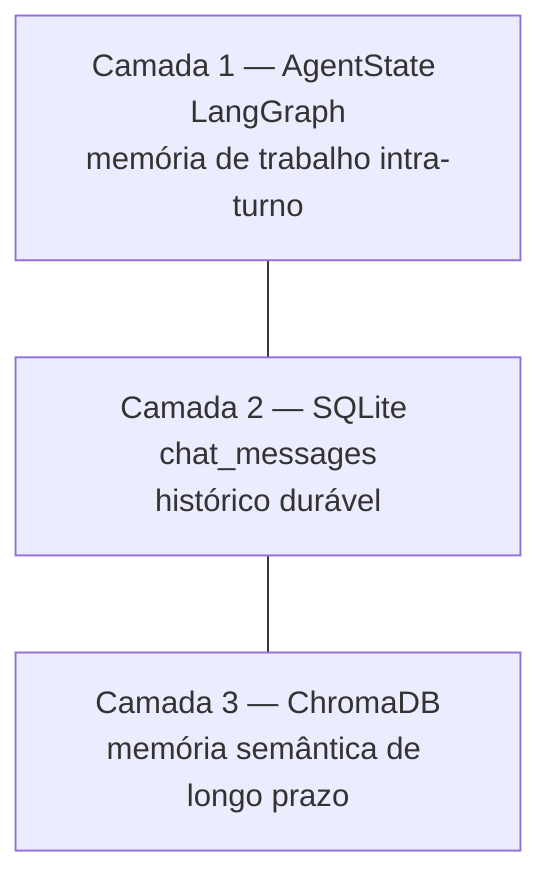
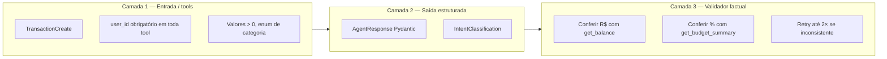
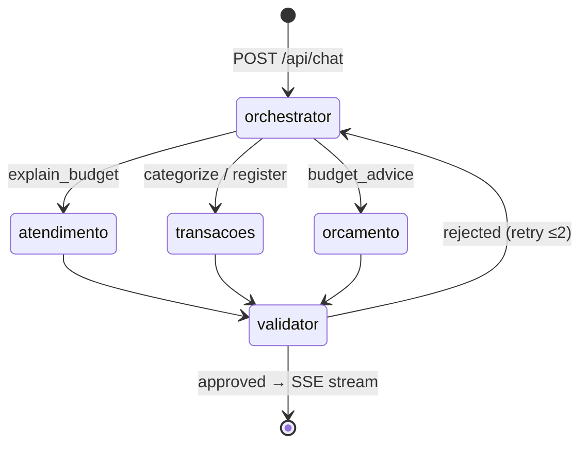

# Guia de Apresentação — Assistente Financeiro com LangGraph

**Público:** curso / demo técnica  
**Foco:** arquitetura multi-agente, LangGraph, contratos, guardrails e MCPs  
**Referências:** [spec.md](./spec.md) · [design.md](./design.md)

---

## 1. Elevator pitch (30 segundos)

> Assistente financeiro conversacional em PT-BR que registra receitas/despesas, monitora orçamento por **envelope budgeting** (5 categorias com faixas %) e responde em linguagem natural — com **LangGraph** orquestrando especialistas, **MCPs** isolando acesso a dados, **RAG** para explicar regras e **guardrails** que impedem alucinações sobre saldos.

**Diferencial técnico:** não é um chatbot monolítico — é um grafo de agentes com estado compartilhado, validação factual e tools padronizadas.

---

## 2. Narrativa sugerida (arco da apresentação)

| Bloco | Tempo | Mensagem central |
| ----- | ----- | ---------------- |
| Problema | 2 min | Planilhas exigem disciplina; apps genéricos não guiam por % de vida |
| Solução | 1 min | Chat + dashboard + envelope budgeting |
| **Por que LangGraph** | 3 min | Supervisor + especialistas + validador — fluxo explícito e testável |
| **AgentState** | 2 min | Memória de trabalho entre nós no mesmo turno |
| **Contratos Pydantic** | 2 min | Fronteira tipada entre LLM, tools e usuário |
| **Walkthrough de código** | 5 min | Seção 19 — nós, contratos, MCP, testes |
| **Guardrails** | 3 min | 3 camadas complementares — não redundantes |
| **MCPs** | 3 min | Tools desacopladas, extensíveis, testáveis |
| **RAG + ChromaDB** | 2 min | Onde retrieval entra (e onde não entra) |
| Demo ao vivo | 5 min | 3 prompts literais da spec |
| Fechamento | 1 min | O que falta (T24–T32) e evolução P2 |

---

## 3. Arquitetura — LangGraph no centro



**Frase para a audiência:** *FastAPI entrega a UI; LangGraph decide quem responde e como; MCPs executam; SQLite guarda a verdade; ChromaDB enriquece com semântica.*

---

## 4. Por que LangGraph?

### O problema de um agente único

Um único agente com todas as tools tende a:

- misturar educação, CRUD e análise de orçamento no mesmo prompt
- errar roteamento em perguntas ambíguas
- alucinar saldos sem checagem dedicada
- ser difícil de testar por cenário

### O que LangGraph resolve

| Capacidade | Benefício |
| ---------- | --------- |
| **StateGraph** | Fluxo explícito: orquestrador → especialista → validador |
| **AgentState compartilhado** | Contexto de trabalho no mesmo turno (`intent`, `retrieved_context`, `last_tool_results`) |
| **Nós especializados** | Prompt e tools menores — cada agente faz uma coisa bem |
| **Conditional edges** | Roteamento por intenção; retry do validador (até 2×) |
| **Testabilidade** | Mock por nó; 3 cenários conversacionais literais na spec |

### Alternativa descartada (mencionar se perguntarem)

- **Chain simples LangChain:** sem estado compartilhado rico nem retry estruturado
- **Microserviços por agente:** overkill para MVP
- **Streamlit:** limitado para auth multi-page + SSE

**Decisão registrada:** AD implícito em design.md — *LangGraph StateGraph, supervisor pattern nativo, shared state*.

---

## 5. Construção dos agentes

### 5.1 Padrão supervisor (spec + design)

```
Usuário
   │
   ▼
 Orquestrador     ← classifica intenção (structured output)
   │
   ├── Atendimento    ← educação, FAQ, plano de gastos (RAG)
   ├── Transações     ← CRUD, categorização, clarificação
   └── Orçamento      ← alertas, economia, faixas %
   │
   ▼
 Validador          ← contrato + checagem factual
   │
   ▼
 Resposta ao usuário
```

**Regra MVP:** **um especialista por turno** — `orquestrador → especialista → validador`. Sem encadeamento multi-especialista no mesmo turno (spec ORCH-01).

### 5.2 Orquestrador

**Papel:** detectar intenção e escolher especialista — não responde ao usuário diretamente.

**Como funciona (design):**

- LLM DeepSeek com **structured output** → contrato `IntentClassification`
- Mapa determinístico intent → especialista
- Confiança baixa → Atendimento (clarificação, ORCH-02)

| Padrão do usuário | Intent | Especialista |
| ----------------- | ------ | ------------ |
| "plano de gastos", "como organizar" | `explain_budget` | Atendimento |
| "qual categoria", "se encaixa" | `categorize` | Transações |
| "economizar", "prestar atenção", "orçamento" | `budget_advice` | Orçamento |
| "gastei", "recebi" | `register_transaction` | Transações |

**Por que structured output aqui?** Roteamento precisa ser parseável e testável — texto livre quebraria o grafo.

**Onde vive:** `agents/orchestrator.py` → nó `orchestrator_node` no `StateGraph`.

### 5.3 Especialista — Atendimento

**Papel:** front-door conversacional — explicar as 5 categorias e FAQs.

**Tools / dados:**

- `chroma-mcp.query_knowledge` → collection `knowledge_base` (RAG)
- Não precisa de transações pré-existentes (CONV-01)

**Padrão de implementação:** RAG **determinístico** — o código recupera docs *antes* de chamar a LLM e injeta como `CONTEXTO`. A LLM não decide se invoca a tool (mais previsível em demo e testes).

**Cenário demo:** *"Quero montar um plano de gastos"* → 5 categorias + faixas + exemplos.

### 5.4 Especialista — Transações

**Papel:** CRUD financeiro e categorização inteligente.

**Dois fluxos distintos (mesmo especialista, intents diferentes):**

| Intent | Comportamento | Spec |
| ------ | ------------- | ---- |
| `categorize` | Explica categoria + `action=offer_register` — **não persiste** | CONV-02 |
| `register_transaction` | Extrai valor/tipo, categoriza, persiste via `finance-mcp` | CHAT-01/02/03 |

**Tools:**

- `finance-mcp.create_transaction` — persiste SQLite + write-through ChromaDB
- `chroma-mcp.find_similar_transactions` — few-shot dinâmico (`transactions` + `category_examples`)

**Por que regex para extrair valor (design gap)?** Spec não define parser NL; regex mantém testes unitários rápidos sem mock de LLM — trade-off consciente.

**Cenários demo:**

- *"Gastei 20 reais num pedido de delivery, em qual categoria..."* → Prazeres + oferta de registro
- *"Gastei R$ 150 no cinema"* → despesa registrada
- *"Recebi R$ 5000 de salário"* → receita com `categoria = NULL`

### 5.5 Especialista — Orçamento

**Papel:** envelope budgeting — % gasto vs faixas, alertas, recomendações.

**Tools:**

- `finance-mcp.get_budget_summary` — números exatos do SQLite (não alucinar %)

**Regras de negócio:**

- % calculado sobre **receita mensal**; despesas por categoria
- Sem receita no mês → orientar registrar receita primeiro (CONV-04)
- Alerta só quando `pct > max_pct` (exceto Prazeres, sem teto de excesso)

**Cenário demo:** *"Em quais categorias devo prestar atenção ou economizar?"* — fixture: receita R$ 5.000 + Custos Fixos 50%, Prazeres 2%.

### 5.6 Validador (quality gate)

**Papel:** última linha de defesa antes da resposta chegar ao usuário.

**Checks (design):**

1. `AgentResponse` Pydantic válido
2. Se menciona valores R$ → confere com `get_balance` / `get_budget_summary`
3. Se menciona categoria → confere enum válido
4. Resposta não vazia, em PT-BR

**Retry:** até **2 tentativas** — validador rejeita → volta ao fluxo (design mermaid: `validator → orchestrator`).

**Por que um nó separado?** Separar *geração* de *verificação factual* — o especialista pode ser criativo no texto; o validador só aceita o que bate com o banco.

> **Status na implementação:** Validador implementado (`agents/validator.py`, T24). O `graph.py` ainda é skeleton — **T25** liga os 3 especialistas + conditional edges de retry.

---

## 6. AgentState — memória de trabalho do LangGraph

LangGraph não guarda só `messages`. O `AgentState` (TypedDict) é lido/escrito por **todos os nós**:

| Campo | Quem escreve | Para quê |
| ----- | ------------ | -------- |
| `messages` | Todos | Histórico da sessão (reducer `add_messages`) |
| `user_id`, `session_id` | Entrada do grafo | Isolamento multi-usuário |
| `intent` | Orquestrador | Roteamento ao especialista |
| `retrieved_context` | Especialista | Trechos RAG do turno |
| `pending_action` | Transações/Orçamento | Ex.: oferta de registro |
| `agent_notes` | Qualquer especialista | Coordenação interna |
| `last_tool_results` | Especialista | Validador confere fatos |
| `validation_attempts` | Validador | Controle de retry |
| `final_response` | Especialista → Validador | `AgentResponse` aprovado |

**3 camadas de memória (spec):**



**Frase para slide:** *SQLite + ChromaDB = longo prazo; AgentState = coordenação em tempo real entre agentes no mesmo fluxo.*

---

## 7. Contratos (Pydantic) — fronteiras tipadas

Contratos são a **interface entre LLM, grafo, tools e usuário**. A spec exige guardrails Pydantic — não confiar só no prompt.

### 7.1 Contratos principais

| Contrato | Onde entra | Por quê |
| -------- | ---------- | ------- |
| `IntentClassification` | Orquestrador | Saída estruturada da classificação (`intent` + `confidence`) |
| `AgentResponse` | Saída de todo especialista | Formato uniforme para UI e validador |
| `TransactionCreate` | CRUD / finance-mcp | Regras de negócio: despesa exige categoria; receita proíbe |
| `BudgetSummary` | Orçamento / dashboard | % e status ok/alerta serializáveis |

### 7.2 AgentResponse — contrato central

```python
# contracts/agent_response.py
class AgentResponse(BaseModel):
    text: str
    suggested_category: BudgetCategory | None = None
    action: Literal["none", "offer_register", "registered"] = "none"
    metadata: dict = {}
```

**Por que `action`?** Separa *explicar* de *registrar* — CONV-02 exige `offer_register` sem persistir automaticamente.

### 7.3 TransactionCreate — regra receita vs despesa

```python
# contracts/transaction.py
@model_validator(mode="after")
def _check_category_matches_type(self):
    if self.type is TransactionType.EXPENSE and self.category is None:
        raise ValueError("category é obrigatório para despesas")
    if self.type is TransactionType.INCOME and self.category is not None:
        raise ValueError("category não é permitido para receitas")
    return self
```

**Por que no Pydantic e não só no prompt?** LLM pode errar; o contrato falha cedo — camada VAL-01.

> Detalhes completos de todos os contratos: **seção 19.7**.

### 7.4 Alinhamento MCP ↔ contratos

Schema JSON das tools MCP alinha com guardrails Pydantic (spec: *"Contrato MCP = schema JSON — alinha com guardrails Pydantic"*).

**Na prática — `finance-mcp.create_transaction` valida antes de persistir:**

```python
# mcp_servers/finance/server.py
@mcp.tool()
def create_transaction(
    user_id: str,          # sempre 1º param — sem default (AD-002)
    date: str,
    description: str,
    type: str,
    amount: str,
    category: str | None = None,
) -> dict:
    payload = TransactionCreate(   # ← guardrail Camada 1
        date=date_.fromisoformat(date),
        description=description,
        type=TransactionType(type),
        amount=Decimal(amount),
        category=BudgetCategory(category) if category else None,
    )
    # ... persist SQLite + index_transaction (write-through)
```

---

## 8. Guardrails — três camadas complementares

A spec diz explicitamente: *Pydantic contracts + validador de resposta + limites de tool — camadas complementares, **não redundantes**.*



### Camada 1 — Guardrails de tool e domínio

| Guardrail | Onde | Exemplo |
| --------- | ---- | ------- |
| `user_id` obrigatório | Todo MCP + ChromaDB | AD-002 — usuário A não vê dados de B |
| `TransactionCreate` | finance-mcp | Receita sem categoria |
| Edge cases spec | Domínio | Valor ≤ 0 rejeitado; 404 cross-user |
| Limiar semântico | chroma-mcp | `score ≥ threshold` em `search_transactions` |

### Camada 2 — Contratos de saída

- Especialista **deve** retornar `AgentResponse` — validador rejeita shape inválido (VAL-01)
- Orquestrador **deve** retornar `IntentClassification` — roteamento determinístico

### Camada 3 — Validador factual (anti-alucinação)

- Se a resposta cita " você gastou R$ X" → `finance-mcp.get_balance`
- Se cita percentuais → `get_budget_summary` (CONV-05)
- Inconsistente → bloqueia e regenera (até 2 retries)

**Slide de impacto:** *"O LLM explica; o banco prova."*

### Degradação graceful (também guardrail operacional)

| Falha | Comportamento |
| ----- | ------------- |
| MCP down | Fallback in-process (MCP-03) |
| ChromaDB down | SQLite LIKE — CRUD intacto (VEC-05) |
| Embedding fail | SQLite persiste; reindex enfileirado |
| DeepSeek timeout | Mensagem amigável, estado intacto |

---

## 9. MCPs — por que e como

### 9.1 O que é MCP neste projeto

**Model Context Protocol** — padroniza tools externas que agentes LangChain consomem via adapter, **sem acoplar lógica de domínio aos nós do grafo**.

```python
# Conceitual — design.md
client = MultiServerMCPClient({
    "finance": {"command": "python", "args": ["-m", "mcp_servers.finance"]},
    "chroma":  {"command": "python", "args": ["-m", "mcp_servers.chroma"]},
})
tools = await client.get_tools()
```

### 9.2 Por que MCP (benefícios na spec)

| Benefício | Aplicação |
| --------- | --------- |
| **Desacoplamento** | SQLite/ChromaDB vivem no servidor MCP, não dentro do nó LangGraph |
| **Reutilização** | Mesmas tools para Transações, Orçamento e Validador |
| **Extensibilidade** | Novos MCPs (câmbio, CSV) sem alterar o grafo |
| **Testabilidade** | MCPs testados isoladamente; agentes mockam tools |
| **Padronização** | Schema JSON alinha com Pydantic |

**Decisão AD-004:** finance-mcp + chroma-mcp como sub-processos, com **fallback in-process** se spawn falhar.

### 9.3 finance-mcp — domínio estruturado (SQLite)

| Tool | Agente(s) | Por quê MCP e não SQL direto no nó |
| ---- | --------- | ------------------------------------ |
| `create_transaction` | Transações | Write-through + contrato único |
| `list_transactions` | Transações | Filtros padronizados |
| `get_budget_summary` | Orçamento, Validador | Fonte autoritativa de % |
| `get_balance` | Validador | Anti-alucinação |
| `update_transaction` / `delete_transaction` | Transações | CRUD + sync ChromaDB |

**Sempre:** `user_id` como primeiro parâmetro obrigatório.

### 9.4 chroma-mcp — semântica (ChromaDB)

| Tool | Uso | RAG? |
| ---- | --- | ---- |
| `query_knowledge` | Regras das 5 categorias | ✅ RAG clássico |
| `find_similar_transactions` | Auto-categorizar por histórico | ✅ RAG few-shot |
| `search_transactions` | "Aquela pizzaria" | ✅ RAG sobre dados do usuário |
| `get_chat_context` | Memória cross-session | ⚠️ Padrão RAG, spec chama "memória" |
| `save_working_memory` | Fatos extraídos entre agentes | Memória estruturada |

**Fallback VEC-05:** só `search_transactions` cai para SQL LIKE se ChromaDB indisponível.

### 9.5 Quem usa qual MCP?

```
┌──────────────┬─────────────┬──────────────────────────────────┐
│ Agente       │ finance-mcp │ chroma-mcp                       │
├──────────────┼─────────────┼──────────────────────────────────┤
│ Orquestrador │      —      │  —                               │
│ Atendimento  │      —      │  query_knowledge                 │
│ Transações   │  CRUD full  │  search + find_similar           │
│ Orçamento    │  budget     │  —                               │
│ Validador    │ get_balance │  —                               │
│              │ get_budget  │                                  │
└──────────────┴─────────────┴──────────────────────────────────┘
```

### 9.6 MCP vs tool in-process

| Cenário | Escolha |
| ------- | ------- |
| Produção / extensibilidade | Subprocesso MCP |
| Dev / CI / cold start lento | Fallback in-process (mesmas funções Python) |
| Latência crítica futura | Tools nativas LangChain para hot path |

---

## 10. Stack de suporte — por que cada peça

| Recurso | Papel | Por quê este (e não outro) |
| ------- | ----- | -------------------------- |
| **LangGraph** | Orquestração multi-agente | StateGraph + shared state + retry; supervisor nativo |
| **DeepSeek** | LLM de chat/reasoning | Solicitado; API OpenAI-compatible via LangChain |
| **multilingual-e5-small** | Embeddings locais | DeepSeek **não** expõe `/embeddings`; PT-BR grátis (AD-003) |
| **ChromaDB** | Índice vetorial | Busca semântica + RAG; integração LangChain |
| **SQLite** | Fonte de verdade | CRUD, orçamento, chat — relacional simples |
| **FastAPI + SSE** | UI chat | Stream do grafo (`astream_events`); auth nativo |
| **Pydantic v2** | Contratos | Validators, structured output, serialização |
| **langchain-mcp-adapters** | Bridge MCP → tools | Tools dinâmicas no grafo sem boilerplate |

**Regra de ouro para slide:**

> **DeepSeek pensa · e5-small embede · SQLite prova · ChromaDB recupera · LangGraph coordena · MCP executa**

---

## 11. RAG no fluxo LangGraph (resumo para demo)

| Momento | Collection | Agente | O que recupera |
| ------- | ---------- | ------ | -------------- |
| Plano de gastos | `knowledge_base` | Atendimento | Regras + faixas + exemplos |
| Categorizar delivery | `category_examples` + `transactions` | Transações | Similaridade → Prazeres |
| Buscar pizzaria | `transactions` | Transações | Histórico do usuário |
| Contexto passado | `chat_memory` | Todos | "Aquela viagem..." |

**Não é RAG:** `get_budget_summary`, `get_balance` — são **tool calling** sobre SQLite.

Fluxo RAG típico no grafo:

```
1. Especialista recebe mensagem (AgentState.messages)
2. Código ou tool recupera docs (chroma-mcp)
3. Trechos → retrieved_context no AgentState
4. LLM gera AgentResponse grounded no contexto
5. Validador confere fatos numéricos no SQLite (se houver)
```

---

## 12. Demo ao vivo — roteiro (3 prompts da spec)

Prepare um usuário logado com fixture de orçamento desbalanceado para o prompt 3.

### Prompt 1 — Atendimento + RAG

```
Quero montar um plano de gastos
```

**Mostrar:** roteamento → Atendimento → `query_knowledge` → resposta com 5 categorias, faixas e exemplos. Sem transações prévias.

### Prompt 2 — Transações + contrato `action`

```
Gastei 20 reais num pedido de delivery, em qual categoria essa despesa se encaixa?
```

**Mostrar:** intent `categorize` → Prazeres → explicação → `offer_register` (não registrou automaticamente).

### Prompt 3 — Orçamento + tool factual

```
Em quais categorias devo prestar mais atenção ou economizar?
```

**Mostrar:** intent `budget_advice` → `get_budget_summary` → categorias acima da faixa ou com margem apertada.

**Fixture sugerida:** receita R$ 5.000; Custos Fixos ~50%; Prazeres ~2%.

---

## 13. Fluxo LangGraph completo (slide técnico)



**Estado que atravessa o grafo:**

```
messages + user_id + session_id
  → orchestrator sets intent
  → specialist sets final_response + last_tool_results + retrieved_context
  → validator sets validation_attempts OR approves
  → resposta SSE ao browser
```

---

## 14. Perguntas frequentes da audiência

### "Por que não um único agente com 11 tools?"

Tools demais no mesmo prompt aumentam erro de seleção e alucinação. Especialistas com 1–2 tools cada + validador dedicado = fluxo testável por cenário.

### "LangGraph vs CrewAI / AutoGen?"

LangGraph oferece grafo explícito, estado tipado e integração nativa LangChain tools/MCP — adequado a pipeline supervisor → specialist → validator com retry.

### "MCP é overkill para monolito?"

No MVP roda in-process com fallback. MCP prepara extensão (CSV import, câmbio) sem refatorar o grafo — decisão de produto, não só infra.

### "Como garantem que o LLM não inventa saldo?"

Validador confere valores citados contra `finance-mcp` — guardrail factual separado da geração.

### "Receita tem categoria?"

Não. `categoria = NULL` para receitas — envelope budgeting só sobre despesas (% da receita mensal).

---

## 15. Roadmap pós-demo (transparência)

| Item | Fase | Nota |
| ---- | ---- | ---- |
| Wire graph completo | T25 | Especialistas + conditional edges + retry |
| Dashboard + chat SSE | T27–T29 | UI consome `AgentResponse` |
| Testes integração 3 cenários | T30–T32 | Prompts literais automatizados |
| Agente Insights | P2 | Comparativo mês a mês |
| filesystem-mcp | P2 | Import/export CSV |
| Checkpoint LangGraph | P2 | Retomar sessão avançada |

---

## 16. Checklist antes de apresentar

- [ ] `.env` com `DEEPSEEK_API_KEY`
- [ ] Migrations aplicadas; usuário de demo criado
- [ ] `seed_all()` da knowledge base executado
- [ ] Fixture de transações para prompt 3
- [ ] Saber explicar: LangGraph → AgentState → contratos → guardrails → MCP → RAG
- [ ] Ter fallback se DeepSeek falhar: mostrar testes unitários mockados (`123+` tests)

---

## 17. Slides sugeridos (título only)

1. Problema: controle financeiro consciente por categorias de vida  
2. Solução: chat + envelope budgeting (5 categorias)  
3. **Arquitetura: LangGraph no centro**  
4. **Por que multi-agente e não um bot só**  
5. **AgentState — memória de trabalho**  
6. **Orquestrador + 3 especialistas**  
7. **Contratos Pydantic — fronteiras tipadas**  
8. **Código ao vivo — seção 19** (AgentState → nós → MCP)  
9. **Guardrails em 3 camadas**  
10. **MCPs — tools desacopladas**  
11. RAG vs tool calling — quando usar cada um  
12. Persistência dual: SQLite + ChromaDB  
13. Demo — 3 prompts  
14. Lições aprendidas + próximos passos  

---

## 18. Referências rápidas no repositório

| Tópico | Arquivo |
| ------ | ------- |
| Regras de negócio / user stories | `.specs/features/financial-assistant/spec.md` |
| Grafo, AgentState, validador | `.specs/features/financial-assistant/design.md` |
| Grafo compilado | `src/financial_assistant/agents/graph.py` |
| Validador | `src/financial_assistant/agents/validator.py` |
| **Apêndice de código (seção 19)** | Este arquivo — walkthrough completo |
| Orquestrador | `src/financial_assistant/agents/orchestrator.py` |
| Contratos | `src/financial_assistant/contracts/` |
| Especialistas | `src/financial_assistant/agents/specialists/` |
| MCP client | `src/financial_assistant/mcp/client.py` |
| finance-mcp / chroma-mcp | `mcp_servers/finance/server.py`, `mcp_servers/chroma/server.py` |
| Decisões de projeto | `.specs/STATE.md` (AD-001 a AD-004) |

---

## 19. Apêndice de código — padrões e montagem na prática

Esta seção é o **walkthrough técnico** para a apresentação: mostre estes trechos ao vivo ou em slides com syntax highlight.

---

### 19.1 Padrão universal de um nó LangGraph

Todo agente segue a mesma assinatura:

```python
def meu_node(state: AgentState, **deps_injetaveis) -> dict:
    """Lê o AgentState; retorna um PATCH parcial — LangGraph faz merge."""
    ...
    return {"campo": valor}   # só os campos que este nó altera
```

| Regra | Por quê |
| ----- | ------- |
| Entrada: `AgentState` | Estado compartilhado tipado |
| Saída: `dict` parcial | LangGraph mergeia no state (reducers em `messages`) |
| `**kwargs` injetáveis | Testes mockam LLM/tools sem subprocesso |
| Função pura de negócio separada | `answer()`, `budget_advice()` — testável sem grafo |

**Exemplo mínimo — nó Atendimento:**

```python
# agents/specialists/atendimento.py
def atendimento_node(state: AgentState) -> dict:
    last_message = state["messages"][-1]
    return {"final_response": answer(last_message.content)}
```

O nó **não** fala com o usuário diretamente — produz `final_response: AgentResponse` para o Validador aprovar.

---

### 19.2 AgentState — definição completa

```python
# agents/state.py
from typing import Annotated, TypedDict
from langchain_core.messages import BaseMessage
from langgraph.graph.message import add_messages
from financial_assistant.contracts.agent_response import AgentResponse


class AgentState(TypedDict):
    # Reducer: append de mensagens (não substitui a lista inteira)
    messages: Annotated[list[BaseMessage], add_messages]

    user_id: str
    session_id: str
    intent: str | None                    # escrito pelo Orquestrador
    retrieved_context: list[str]          # RAG do turno
    pending_action: dict | None           # ex.: {"type": "offer_register"}
    agent_notes: list[str]                # notas internas cross-agent
    last_tool_results: dict | None        # output bruto das tools
    validation_attempts: int              # contador de retry
    final_response: AgentResponse | None  # saída do especialista
```

**Como inicializar uma invocação do grafo:**

```python
from langchain_core.messages import HumanMessage

initial_state: AgentState = {
    "messages": [HumanMessage(content="Quero montar um plano de gastos")],
    "user_id": str(user.id),
    "session_id": session_id,
    "intent": None,
    "retrieved_context": [],
    "pending_action": None,
    "agent_notes": [],
    "last_tool_results": None,
    "validation_attempts": 0,
    "final_response": None,
}
result = graph.invoke(initial_state)
```

**Campo-chave para apresentação:** `messages` usa reducer `add_messages` — cada nó pode fazer `return {"messages": [AIMessage(...)]}` sem apagar o histórico.

---

### 19.3 Montagem do grafo — hoje vs alvo (T25)

**Hoje (skeleton T19 — compila, mas pula especialistas):**

```python
# agents/graph.py (estado atual)
from langgraph.graph import END, START, StateGraph
from financial_assistant.agents.orchestrator import orchestrator_node
from financial_assistant.agents.state import AgentState


def build_graph():
    graph = StateGraph(AgentState)
    graph.add_node("orchestrator", orchestrator_node)
    graph.add_node("validator", validator_node)   # T24 implementado; graph ainda importa stub local
    graph.add_edge(START, "orchestrator")
    graph.add_edge("orchestrator", "validator")   # ← pula especialistas (temporário)
    graph.add_edge("validator", END)
    return graph.compile()
```

**Alvo T25 — grafo completo com conditional routing:**

```python
# Conceitual — design.md + spec ORCH-01
from langgraph.graph import END, START, StateGraph
from financial_assistant.agents.orchestrator import orchestrator_node, specialist_for_intent
from financial_assistant.agents.specialists.atendimento import atendimento_node
from financial_assistant.agents.specialists.transacoes import transacoes_node
from financial_assistant.agents.specialists.orcamento import orcamento_node
from financial_assistant.agents.validator import validator_node


def _route_to_specialist(state: AgentState) -> str:
    """Conditional edge após orquestrador."""
    from financial_assistant.contracts.agent_response import Intent
    intent = Intent(state["intent"])
    return specialist_for_intent(intent)   # "atendimento" | "transacoes" | "orcamento"


def _after_validator(state: AgentState) -> str:
    """Retry loop: rejeitado → orquestrador; aprovado → END."""
    if state["final_response"] is None and state["validation_attempts"] < 2:
        return "orchestrator"
    return END


def build_graph():
    graph = StateGraph(AgentState)
    graph.add_node("orchestrator", orchestrator_node)
    graph.add_node("atendimento", atendimento_node)
    graph.add_node("transacoes", transacoes_node)
    graph.add_node("orcamento", orcamento_node)
    graph.add_node("validator", validator_node)

    graph.add_edge(START, "orchestrator")
    graph.add_conditional_edges("orchestrator", _route_to_specialist, {
        "atendimento": "atendimento",
        "transacoes": "transacoes",
        "orcamento": "orcamento",
    })
    for specialist in ("atendimento", "transacoes", "orcamento"):
        graph.add_edge(specialist, "validator")
    graph.add_conditional_edges("validator", _after_validator, {
        "orchestrator": "orchestrator",
        END: END,
    })
    return graph.compile()
```

**Slide visual do fluxo de dados:**

```
HumanMessage → orchestrator sets intent
            → specialist sets final_response (+ optional last_tool_results)
            → validator approves OR clears final_response for retry
            → END with AgentResponse
```

---

### 19.4 Orquestrador — structured output + mapa determinístico

**Passo 1 — LLM classifica com contrato Pydantic:**

```python
# agents/orchestrator.py
SPECIALIST_BY_INTENT: dict[Intent, str] = {
    Intent.EXPLAIN_BUDGET: "atendimento",
    Intent.CATEGORIZE: "transacoes",
    Intent.BUDGET_ADVICE: "orcamento",
    Intent.REGISTER_TRANSACTION: "transacoes",
}

def classify_intent(message: str, llm=None) -> IntentClassification:
    model = llm or get_orchestrator_llm()
    structured = model.with_structured_output(IntentClassification)
    return structured.invoke([
        ("system", SYSTEM_PROMPT),
        ("human", message),
    ])
```

**Passo 2 — mapa fixo (LLM não escolhe o nó diretamente):**

```python
def specialist_for_intent(intent: Intent, confidence: float = 1.0) -> str:
    if confidence < 0.5:          # ORCH-02 — ambíguo → Atendimento
        return "atendimento"
    return SPECIALIST_BY_INTENT[intent]
```

**Passo 3 — nó grava só `intent` no state:**

```python
def orchestrator_node(state: AgentState) -> dict:
    last_message = state["messages"][-1]
    classification = classify_intent(last_message.content)
    return {"intent": classification.intent.value}
```

**Por que separar classify vs route?** A LLM só faz classificação semântica; o roteamento é código testável — `@pytest.mark.parametrize` com os 3 prompts literais da spec.

---

### 19.5 Especialistas — três padrões distintos

#### Padrão A — LLM + RAG determinístico (Atendimento)

Recuperação **antes** da LLM — não é ReAct/tool-calling agentic:

```python
def answer(message: str, llm=None) -> AgentResponse:
    model = llm or get_atendimento_llm()
    docs = query_knowledge.invoke({"query": message})   # chroma-mcp por baixo
    context = "\n".join(f"- {doc['document']}" for doc in docs)
    messages = [
        SystemMessage(SYSTEM_PROMPT),
        HumanMessage(f"CONTEXTO:\n{context}\n\nPERGUNTA: {message}"),
    ]
    response = model.invoke(messages)
    return AgentResponse(text=response.content)
```

| Escolha | Motivo |
| ------- | ------ |
| RAG no código, não na LLM | Resposta sempre grounded; testes mockam `query_knowledge` |
| `AgentResponse(text=...)` | Validador e UI consomem shape fixo |
| Sem `action` | Atendimento só explica — não persiste |

#### Padrão B — Regex + MCP, sem LLM (Transações)

Dois fluxos no **mesmo nó**, dispatch por `state["intent"]`:

```python
def transacoes_node(state: AgentState, *, find_similar=None, create=None) -> dict:
    message = state["messages"][-1].content
    user_id = state["user_id"]

    if state.get("intent") == Intent.CATEGORIZE.value:
        # CONV-02: explica + offer_register — NÃO chama create
        response = _handle_categorize(message, user_id, find_similar=find_similar)
    else:
        # CHAT-01: parse → categorize → finance-mcp.create_transaction
        response = _handle_register(message, user_id, find_similar=find_similar, create=create)

    return {"final_response": response}
```

**Categorização via similaridade semântica:**

```python
def categorize(description, user_id, find_similar=None) -> BudgetCategory | None:
    finder = find_similar or _find_similar_transactions   # chroma-mcp
    hits = finder(user_id=user_id, description=description)
    for hit in hits:
        cat = hit.get("metadata", {}).get("category")
        if cat:
            return BudgetCategory(cat)
    return None
```

**Resposta com contrato `action` — separa explicar de registrar:**

```python
# CONV-02 — delivery → Prazeres, sem persistir
return AgentResponse(
    text="Essa despesa se encaixa na categoria **prazeres** porque ...",
    suggested_category=BudgetCategory.PLEASURES,
    action="offer_register",          # ← UI pode mostrar botão "Registrar"
)

# CHAT-01 — cinema → persiste
return AgentResponse(
    text='Registrei uma despesa de R$ 150,00 na categoria prazeres: "cinema".',
    suggested_category=BudgetCategory.PLEASURES,
    action="registered",
    metadata={"transaction": created},  # Validador usa amount recém-persistido
)
```

#### Padrão C — Só tools, sem LLM (Orçamento)

Números vêm **100% do SQLite** via MCP — zero alucinação possível na origem:

```python
def budget_advice(user_id, month=None, *, get_summary=None) -> AgentResponse:
    fetch = get_summary or _get_budget_summary
    summary = fetch(user_id=user_id, month=month or date.today().strftime("%Y-%m"))

    if not summary["has_income"]:                    # CONV-04
        return AgentResponse(text=NO_INCOME_ADVICE)

    lines = ["Categorias que merecem atenção este mês:"]
    for cat in _prioritized_categories(summary["categories"]):
        lines.append(_format_line(cat))
    return AgentResponse(text="\n".join(lines))
```

**Priorização determinística:**

```python
def _needs_attention(category: dict) -> bool:
    return category["status"] == "alerta" or category["remaining_pct"] <= 5.0
```

| Especialista | Usa LLM? | Usa MCP? | Padrão |
| ------------ | -------- | -------- | ------ |
| Atendimento | ✅ (com RAG) | chroma | LLM grounded |
| Transações | ❌ (regex) | finance + chroma | Tool pipeline |
| Orçamento | ❌ | finance | Template sobre dados |

---

### 19.6 Validador — guardrail factual em código

```python
# agents/validator.py — checks em sequência
def validate(response, *, user_id, get_balance=None, get_budget_summary=None):
    checked = _coerce_response(response)       # VAL-01: AgentResponse válido
    if checked is None:
        return ValidationResult(False, "AgentResponse inválido")
    if not checked.text.strip():
        return ValidationResult(False, "resposta vazia")
    if not _looks_like_pt_br(checked.text):  # VAL-02: heurística PT-BR
        return ValidationResult(False, "não parece PT-BR")

    amounts = _extract_currency_values(checked.text)   # regex R$ ...
    percents = _extract_percent_values(checked.text)   # regex N%

    if amounts or percents:
        balance = fetch_balance(user_id=user_id, month=month)
        summary = fetch_summary(user_id=user_id, month=month)
        # VAL-03 / CONV-05: valor citado deve existir no banco
        for amount in amounts:
            if not _matches(amount, _known_amounts(balance, summary, checked)):
                return ValidationResult(False, f"valor R$ {amount} não confere")

    return ValidationResult(True, None)
```

**Nó com retry loop:**

```python
def validator_node(state: AgentState, **deps) -> dict:
    attempts = state["validation_attempts"] + 1
    result = validate(state["final_response"], user_id=state["user_id"], **deps)

    if result.approved:
        return {"validation_attempts": attempts}

    if attempts >= MAX_VALIDATION_ATTEMPTS:   # 2 retries (design)
        return {
            "validation_attempts": attempts,
            "final_response": AgentResponse(text=FALLBACK_TEXT),
            "agent_notes": [*state["agent_notes"], f"validator: {result.reason}"],
        }

    # Sinal para T25: final_response=None → conditional edge volta ao orquestrador
    return {"validation_attempts": attempts, "final_response": None, ...}
```

**Detalhe inteligente:** transação recém-criada entra em `_known_amounts` via `metadata["transaction"]` — citar R$ 150 logo após registrar não é rejeitado como alucinação.

---

### 19.7 Contratos Pydantic — código completo

#### Intent + classificação (entrada do grafo)

```python
# contracts/agent_response.py
class Intent(str, Enum):
    EXPLAIN_BUDGET = "explain_budget"
    CATEGORIZE = "categorize"
    BUDGET_ADVICE = "budget_advice"
    REGISTER_TRANSACTION = "register_transaction"


class IntentClassification(BaseModel):
    intent: Intent
    confidence: float = Field(ge=0.0, le=1.0)   # structured output do Orquestrador
```

#### Saída uniforme de todo especialista

```python
class AgentResponse(BaseModel):
    text: str
    suggested_category: BudgetCategory | None = None
    action: Literal["none", "offer_register", "registered"] = "none"
    metadata: dict = {}
```

| Propriedade | Tipo | Quem seta | Para quê |
| ----------- | ---- | --------- | -------- |
| `text` | `str` | Especialista | Resposta ao usuário (SSE) |
| `suggested_category` | `BudgetCategory \| None` | Transações | UI + validador de enum |
| `action` | `Literal[...]` | Transações | Diferencia explicar vs registrar |
| `metadata` | `dict` | Transações | `transaction` recém-criada p/ validador |

#### Regra de negócio receita/despesa

```python
# contracts/transaction.py
class TransactionCreate(BaseModel):
    date: date
    description: str = Field(min_length=1, max_length=255)
    type: TransactionType
    amount: Decimal = Field(gt=Decimal("0"))
    category: BudgetCategory | None = None

    @model_validator(mode="after")
    def _check_category_matches_type(self):
        if self.type is TransactionType.EXPENSE and self.category is None:
            raise ValueError("category é obrigatório para despesas")
        if self.type is TransactionType.INCOME and self.category is not None:
            raise ValueError("category não é permitido para receitas")
        return self
```

#### Read-model de orçamento (espelha BudgetService)

```python
# contracts/budget.py
class CategoryStatus(BaseModel):
    model_config = ConfigDict(from_attributes=True)   # ← constrói de dataclass T10

    category: BudgetCategory
    spent: Decimal
    pct: float
    min_pct: float
    max_pct: float
    target_pct: float
    status: Literal["ok", "alerta"]
    remaining_pct: float
    over_amount: Decimal


class BudgetSummary(BaseModel):
    model_config = ConfigDict(from_attributes=True)
    month: str
    total_income: Decimal
    has_income: bool
    warning: str | None
    categories: list[CategoryStatus]
```

**Padrão `from_attributes=True`:** domain layer usa dataclasses; contratos Pydantic serializam para JSON/MCP sem duplicar lógica.

---

### 19.8 MCP — como uma tool é exposta

```python
# mcp_servers/finance/server.py
from mcp.server.fastmcp import FastMCP

mcp = FastMCP("finance-mcp")

@mcp.tool()
def get_budget_summary(user_id: str, month: str | None = None) -> dict:
    """Retorna BudgetSummary serializado — fonte autoritativa de %."""
    with SessionLocal() as session:
        summary = BudgetService(session).get_summary(uuid.UUID(user_id), month)
        return BudgetSummaryContract.model_validate(summary).model_dump()
```

```python
# mcp_servers/chroma/server.py — busca com fallback VEC-05
@mcp.tool()
def search_transactions(user_id: str, query: str, n_results: int = 5) -> list[dict]:
    try:
        hits = _semantic_query("transactions", query, n_results, where={"user_id": user_id})
        threshold = get_settings().chroma_similarity_threshold
        return [h for h in hits if h["score"] >= threshold]
    except Exception:
        # degradar para SQL LIKE — CRUD intacto
        rows = TransactionRepository(session).search_by_description(uuid.UUID(user_id), query)
        return [_fallback_hit(row) for row in rows]
```

**Propriedades comuns de toda tool MCP neste projeto:**

| Propriedade | Regra |
| ----------- | ----- |
| 1º argumento | `user_id: str` — obrigatório, sem default |
| Retorno | `dict` ou `list[dict]` — JSON-serializável |
| Decorator | `@mcp.tool()` — FastMCP gera schema JSON |
| Isolamento | Queries filtram `user_id` (exceto KB global) |

---

### 19.9 MCP Client — bridge para LangGraph

```python
# mcp/client.py
MCP_CONNECTIONS = {
    "finance": {"transport": "stdio", "command": "python",
                "args": ["-m", "mcp_servers.finance"]},
    "chroma":  {"transport": "stdio", "command": "python",
                "args": ["-m", "mcp_servers.chroma"]},
}

async def get_mcp_tools(client=None) -> list[BaseTool]:
    client = client or MultiServerMCPClient(MCP_CONNECTIONS)
    try:
        return await client.get_tools()          # 11 tools como StructuredTool
    except Exception:
        logger.warning("falling back to in-process tools", exc_info=True)
        return in_process_tools()                # mesmas funções Python, sem subprocesso
```

**Fallback in-process — zero reimplementação:**

```python
def in_process_tools() -> list[BaseTool]:
    return [
        StructuredTool.from_function(func)
        for func in (
            finance_mcp.create_transaction,
            finance_mcp.get_budget_summary,
            # ... + 9 outras
        )
    ]
```

LangGraph (T25+) carrega `await get_mcp_tools()` na inicialização e injeta nos especialistas que precisarem de tool-calling dinâmico.

---

### 19.10 Padrão de injeção de dependência (testabilidade)

Todos os módulos críticos aceitam overrides — **mesma assinatura em prod e teste:**

```python
# Orquestrador
classify_intent(message, llm=_FakeChatModel(...))

# Atendimento
answer(message, llm=_EchoChatModel())

# Transações
transacoes_node(state, find_similar=fake_finder, create=fake_create)

# Orçamento
budget_advice(user_id, get_summary=fake_summary)

# Validador
validate(response, get_balance=fake_balance, get_budget_summary=fake_summary)
```

**Exemplo de teste — 3 prompts literais sem DeepSeek:**

```python
# tests/unit/test_orchestrator_routing.py
@pytest.mark.parametrize("message,intent,specialist", [
    ("Quero montar um plano de gastos", Intent.EXPLAIN_BUDGET, "atendimento"),
    ("Gastei 20 reais num pedido de delivery, em qual categoria ...",
     Intent.CATEGORIZE, "transacoes"),
    ("Em quais categorias devo prestar mais atenção ...",
     Intent.BUDGET_ADVICE, "orcamento"),
])
def test_routing(message, intent, specialist):
    classification = classify_intent(message, llm=_fake_llm(intent))
    assert specialist_for_intent(classification.intent) == specialist
```

**Exemplo — Atendimento grounded sem ChromaDB:**

```python
# tests/unit/test_atendimento.py
def test_plano_de_gastos(monkeypatch):
    monkeypatch.setattr(atendimento, "query_knowledge", lambda q, n: _FIXTURE_DOCS)
    response = atendimento.answer("Quero montar um plano de gastos", llm=_EchoChatModel())
    for name in ["Custos Fixos", "Conforto", "Investimentos", "Conhecimento e Metas", "Prazeres"]:
        assert name in response.text
```

---

### 19.11 Walkthrough de um turno completo (estado mutando)

Prompt: *"Gastei 20 reais num pedido de delivery, em qual categoria essa despesa se encaixa?"*

```
┌─ Estado inicial ─────────────────────────────────────────────┐
│ messages: [HumanMessage("Gastei 20 reais...")]              │
│ intent: None                                               │
│ final_response: None                                       │
│ validation_attempts: 0                                     │
└────────────────────────────────────────────────────────────┘
         │
         ▼ orchestrator_node
┌─ Após orquestrador ────────────────────────────────────────┐
│ intent: "categorize"                                       │
└────────────────────────────────────────────────────────────┘
         │
         ▼ transacoes_node (intent == categorize)
┌─ Após transações ──────────────────────────────────────────┐
│ final_response: AgentResponse(                             │
│   text="... categoria prazeres ... Quer que eu registre?", │
│   suggested_category=PLEASURES,                            │
│   action="offer_register"                                  │
│ )                                                          │
└────────────────────────────────────────────────────────────┘
         │
         ▼ validator_node
┌─ Após validador ───────────────────────────────────────────┐
│ validation_attempts: 1                                     │
│ final_response: (mesmo AgentResponse — aprovado)           │
└────────────────────────────────────────────────────────────┘
         │
         ▼ END → SSE stream de final_response.text ao browser
```

Prompt alternativo: *"Recebi R$ 5000 de salário"*

```
intent: "register_transaction"
  → parse_transaction_message → type=INCOME, amount=5000
  → category=None (CHAT-02 — pula categorize)
  → finance-mcp.create_transaction → SQLite + ChromaDB index
  → AgentResponse(action="registered", metadata={"transaction": {...}})
  → validador aprova (amount em metadata entra em known_amounts)
```

---

### 19.12 Mapa arquivo → responsabilidade (para navegar no IDE ao vivo)

```
src/financial_assistant/
├── agents/
│   ├── state.py              ← AgentState TypedDict
│   ├── graph.py              ← StateGraph compile
│   ├── orchestrator.py       ← classify_intent + orchestrator_node
│   ├── validator.py          ← validate() + validator_node + retry
│   └── specialists/
│       ├── atendimento.py    ← RAG + LLM
│       ├── transacoes.py     ← regex + MCP
│       └── orcamento.py      ← template + get_budget_summary
├── contracts/
│   ├── agent_response.py     ← Intent, IntentClassification, AgentResponse
│   ├── transaction.py        ← TransactionCreate + validator
│   └── budget.py             ← BudgetSummary, CategoryStatus
└── mcp/
    └── client.py             ← MultiServerMCPClient + fallback

mcp_servers/
├── finance/server.py         ← 6 tools SQLite
└── chroma/server.py          ← 5 tools ChromaDB + fallback SQL
```

---

### 19.13 Frases prontas para explicar cada trecho ao vivo

| Mostrar este código | Dizer |
| ------------------- | ----- |
| `AgentState` | "Este é o clipboard compartilhado — cada nó lê e escreve pedaços." |
| `with_structured_output(IntentClassification)` | "A LLM não escolhe livremente — devolve JSON validado pelo Pydantic." |
| `SPECIALIST_BY_INTENT` | "Roteamento é código, não prompt — testável e determinístico." |
| `action="offer_register"` | "Contrato expressa intenção de UI — explicar ≠ registrar." |
| `TransactionCreate` validator | "Regra de negócio na borda — antes de tocar o banco." |
| `validate()` + regex R$ | "LLM escreve prose; validador prova números contra SQLite." |
| `@mcp.tool()` + `user_id` | "Toda tool exige dono — multi-tenant by design." |
| `in_process_tools()` | "MCP é protocolo, não obriga subprocesso — fallback transparente." |
| `_FakeChatModel` nos testes | "123 testes verdes sem gastar token DeepSeek." |

---

*Boa apresentação — conduza pela pergunta "quem decide, quem executa, quem valida?" e LangGraph será o fio condutor natural.*
