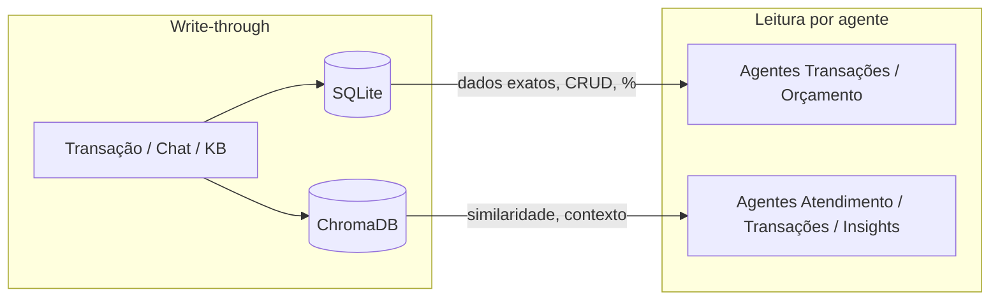
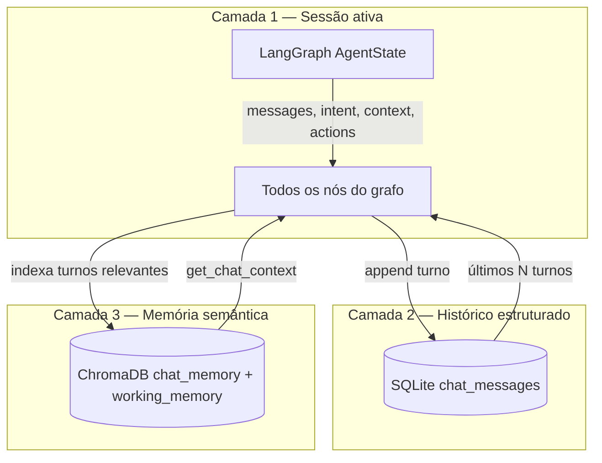

# Assistente Financeiro com Agentes — Specification

## Problem Statement

Pessoas têm dificuldade em manter controle financeiro consistente e alinhado a uma estratégia de alocação consciente. Planilhas exigem disciplina manual; apps genéricos não guiam o usuário pelos percentuais ideais por categoria de vida. Este sistema combina chat conversacional com agentes especializados para registrar movimentações, visualizar gastos/receitas e manter o usuário dentro das faixas de orçamento por envelope.

## Goals

- [ ] Usuário registra receitas e despesas via chat e visualiza lançamentos na tabela do dashboard
- [ ] Sistema classifica transações nas 5 categorias de orçamento e alerta desvios de percentual
- [ ] Arquitetura multi-agente (orquestrador + especialistas + validador) com contratos e guardrails
- [ ] Memória semântica via ChromaDB para busca contextual e categorização inteligente
- [ ] MCPs como camada de extensibilidade — tools padronizadas consumidas pelos agentes via LangChain


## Out of Scope


| Feature                                 | Reason                             |
| --------------------------------------- | ---------------------------------- |
| Integração bancária (Open Finance)      | Complexidade externa — fase futura |
| App mobile nativo                       | Web responsiva cobre MVP           |
| Relatórios PDF/exportação avançada      | P2/P3                              |
| Pagamentos ou transferências reais      | Apenas registro e análise          |
| Investimentos com cotação em tempo real | Apenas registro manual de aportes  |
| OAuth / SSO / 2FA                       | Auth simples email+senha no MVP    |


---


## Assumptions & Open Questions


| Assumption / decision    | Chosen default                                                                      | Rationale                                                                                                                               | Confirmed? |
| ------------------------ | ----------------------------------------------------------------------------------- | --------------------------------------------------------------------------------------------------------------------------------------- | ---------- |
| Persistência estruturada | SQLite local (`data/finance.db`)                                                    | Transações, orçamento, metadados — fonte de verdade relacional                                                                          | y          |
| Persistência vetorial    | ChromaDB local (`data/chroma/`)                                                     | Embeddings para busca semântica, memória de chat e base de conhecimento                                                                 | y          |
| Embeddings               | **Local:** `intfloat/multilingual-e5-small` via LangChain `HuggingFaceEmbeddings`   | DeepSeek não expõe API oficial de embeddings; LLM de chat ≠ modelo de embedding; modelo multilingual cobre PT-BR sem custo extra de API | y          |
| Interface                | **FastAPI** + templates Jinja2 + HTMX — chat + dashboard web                        | Usuário pediu página visual; stack Python unificada                                                                                     | y          |
| Autenticação             | Registro/login com nome, email, senha; JWT em cookie httpOnly; bcrypt               | Auth simples multi-usuário; dados isolados por `user_id`                                                                                | y          |
| Percentuais de orçamento | Defaults: Custos Fixos 35%, Conforto 17%, Investimentos 20%, Conhecimento 10%, Prazeres 8% (soma 90% — margem intencional) | Centro das faixas; 10% restante é buffer de flexibilidade                                                                               | y          |
| Base de cálculo dos %    | Sobre receita mensal total do usuário autenticado                                   | Padrão de envelope budgeting                                                                                                            | y          |
| Idioma do agente         | Português (BR)                                                                      | Preferência do usuário                                                                                                                  | y          |
| LLM                      | DeepSeek via API OpenAI-compatible                                                  | Solicitado pelo usuário                                                                                                                 | y          |
| MCPs MVP                 | `finance-mcp` + `chroma-mcp`                                                        | Extensibilidade e isolamento de domínio no MVP                                                                                          | y          |
| MCPs P2                  | `filesystem-mcp`                                                                    | Import/export CSV e relatórios — usado pelo agente Insights                                                                               | y          |
| Sync SQLite ↔ ChromaDB   | Write-through com `user_id` em metadata                                             | Isolamento multi-usuário + consistência                                                                                                 | y          |
| Guardrails               | Pydantic contracts + validador de resposta + limites de tool                        | Camadas complementares, não redundantes                                                                                                 | y          |


**Open questions:** none — resolvidas nesta iteração.

---


## Framework de Orçamento (Regra de Negócio Central)

Categorias e faixas alvo sobre a **receita mensal**:


| Categoria                | Faixa alvo | Exemplos                                 |
| ------------------------ | ---------- | ---------------------------------------- |
| **Custos Fixos**         | 30–40%     | Aluguel, condomínio, luz, água, parcelas |
| **Conforto**             | 15–20%     | Diarista, streaming, internet            |
| **Investimentos**        | 15–25%     | Aportes, reserva, patrimônio             |
| **Conhecimento e Metas** | 5–15%      | Cursos, livros, viagens planejadas       |
| **Prazeres**             | ≥ 5%       | Cinema, restaurantes, lazer              |


**Regras:**

- A soma das faixas mínimas pode exceder 100%; o sistema SHALL usar defaults dentro das faixas e alertar quando a configuração do usuário for inconsistente.
- Os defaults somam **90%** de propósito — os 10% restantes são margem de flexibilidade, não erro de configuração.
- **Receitas** (`tipo = receita`) SHALL ter `categoria = NULL` — percentuais de envelope aplicam-se apenas a **despesas**.

---


## Persistência Dual: SQLite + ChromaDB

Dois bancos, papéis distintos — **SQLite é fonte de verdade**, **ChromaDB é índice semântico**.




### SQLite — dados estruturados


| Tabela           | Conteúdo                                                         |
| ---------------- | ---------------------------------------------------------------- |
| `users`          | id, name, email, password_hash, created_at                       |
| `transactions`   | id, user_id, data, descrição, tipo, valor, categoria (NULL para receitas), created_at |
| `budget_targets` | id, user_id, categoria, min_%, max_%, target_%, updated_at       |
| `chat_sessions`  | id, user_id, session_id, created_at                              |
| `chat_messages`  | id, user_id, session_id, role, content, timestamp                |


### ChromaDB — coleções vetoriais


| Collection          | O que armazena                                                                      | Para quê                                                        |
| ------------------- | ----------------------------------------------------------------------------------- | --------------------------------------------------------------- |
| `transactions`      | Embedding da descrição + metadata (user_id, transaction_id, categoria, valor, data) | Busca semântica isolada por usuário                             |
| `chat_memory`       | Embeddings de turnos relevantes do chat                                             | Memória de longo prazo — retomar contexto de sessões anteriores |
| `knowledge_base`    | Regras de orçamento, exemplos por categoria, FAQs                                   | RAG para agente Atendimento e categorização                     |
| `category_examples` | Descrições históricas rotuladas por categoria                                       | Few-shot dinâmico para classificar novas despesas               |
| `working_memory`    | Fatos estruturados extraídos de turnos de chat                                      | Coordenação cross-agent — metas, valores estimados, preferências  |


### Fluxo write-through

1. Agente cria transação → persiste no SQLite (commit)
2. Serviço de indexação gera embedding da descrição
3. Upsert no ChromaDB `transactions` com `transaction_id` como metadata
4. Em update/delete → sincroniza embedding correspondente


### Embeddings — decisão técnica

**Não usar a LLM (DeepSeek) para gerar embeddings.** Chat/reasoning e embedding são tarefas distintas: a LLM gera texto; o embedder gera vetores densos otimizados para similaridade coseno.


| Opção                             | Veredicto         | Motivo                                                                          |
| --------------------------------- | ----------------- | ------------------------------------------------------------------------------- |
| DeepSeek chat como embedder       | ❌                 | API oficial só expõe `/chat/completions` — sem `/embeddings` documentado        |
| OpenAI `text-embedding-3-small`   | ⚠️ Alternativa    | Funciona, mas adiciona segundo vendor + custo por token                         |
| `multilingual-e5-small` **local** | ✅ **Recomendado** | Grátis, offline, 384 dims, bom em PT-BR, integração nativa LangChain + ChromaDB |
| Ollama `nomic-embed-text`         | ⚠️ Alternativa    | Requer Ollama rodando; útil se já usar Ollama no ambiente                       |


**Config proposta:**

```python
from langchain_huggingface import HuggingFaceEmbeddings

embeddings = HuggingFaceEmbeddings(
    model_name="intfloat/multilingual-e5-small",
    model_kwargs={"device": "cpu"},
    encode_kwargs={"normalize_embeddings": True},
)
```

Dimensão fixa **384** — configurar ChromaDB collection uma vez; não trocar modelo sem reindexar.

---


## Memória Dinâmica Entre Agentes

A persistência dual **cobre memória de longo prazo**, mas **não basta sozinha** para coordenação em tempo real entre agentes. O MVP usa **3 camadas complementares**:




### Camada 1 — `AgentState` (LangGraph) — memória de trabalho

Estado compartilhado **dentro da execução do grafo** (orquestrador → especialista → validador). Todos os nós leem e escrevem no mesmo objeto via reducers.


| Campo               | Quem escreve                  | Quem lê                      | Propósito                                            |
| ------------------- | ----------------------------- | ---------------------------- | ---------------------------------------------------- |
| `messages`          | Todos                         | Todos                        | Histórico da conversa na sessão                      |
| `intent`            | Orquestrador                  | Especialistas                | Roteamento e contexto                                |
| `retrieved_context` | Especialista (via chroma-mcp) | Validador, resposta final    | RAG recuperado neste turno                           |
| `pending_action`    | Transações/Orçamento          | Validador                    | Ação proposta antes de confirmar ao usuário          |
| `agent_notes`       | Qualquer especialista         | Orquestrador (próximo turno) | Anotações internas — ex.: "usuário mencionou viagem" |
| `last_tool_results` | Especialista                  | Validador                    | Checagem factual contra dados reais                  |


**Exemplo dinâmico:** Transações registra despesa → escreve `pending_action` + atualiza `last_tool_results` → Orçamento (se acionado em sequência) lê o mesmo state → Validador confere saldo contra `last_tool_results`.

### Camada 2 — SQLite — histórico durável

`chat_messages` persiste cada turno. Qualquer agente pode reconstruir contexto recente carregando últimos **N** turnos (ex.: 20) no início do grafo.

### Camada 3 — ChromaDB — memória semântica compartilhada


| Collection       | Escrita                                             | Leitura                                 | Dinâmica entre agentes                                                                                |
| ---------------- | --------------------------------------------------- | --------------------------------------- | ----------------------------------------------------------------------------------------------------- |
| `chat_memory`    | Orquestrador indexa turnos marcados como relevantes | Todos via `chroma-mcp.get_chat_context` | Transações anota "viagem Japão" → Atendimento recupera semânticamente na sessão seguinte              |
| `working_memory` | Especialistas gravam fatos extraídos do turno       | Orquestrador + especialistas            | Fatos estruturados: `{ "meta": "viagem", "valor_estimado": 8000, "categoria": "conhecimento_metas" }` |
| `transactions`   | Transações (write-through)                          | Transações, Insights                    | Busca cross-agent: Orçamento pergunta indiretamente via contexto injetado pelo Orquestrador           |


### O que a spec já cobre vs. o que falta implementar


| Necessidade                                   | Coberto?   | Onde                                                       |
| --------------------------------------------- | ---------- | ---------------------------------------------------------- |
| Dados financeiros compartilhados              | ✅          | SQLite via `finance-mcp` — qualquer agente lê estado atual |
| Busca semântica cross-session                 | ✅          | ChromaDB `chat_memory` + `chroma-mcp`                      |
| Estado compartilhado intra-turno              | ✅          | `AgentState` LangGraph — ver `design.md`                   |
| Escrita dinâmica entre agentes no mesmo fluxo | ✅ (spec)   | `agent_notes` + `last_tool_results` no state               |
| Memória de fatos extraídos (não só texto)     | ✅ (spec)   | ChromaDB `working_memory`                                  |
| Checkpoint de sessão (retomar conversa)       | ⚠️ Parcial | SQLite `chat_sessions` — checkpoint LangGraph em P2        |


**Resposta direta:** SQLite + ChromaDB cobrem **persistência e memória semântica de longo prazo**. Para **memória dinâmica entre agentes no mesmo fluxo**, é necessário o `AgentState` **compartilhado do LangGraph** — camada explícita adicionada acima. Sem ela, agentes só se coordenam re-consultando bancos a cada hop (funciona, mas perde contexto de trabalho e é mais lento).

---


## MCPs — Usabilidade no Projeto

MCPs (Model Context Protocol) padronizam **tools externas** que qualquer agente LangChain consome via adapter — sem acoplar lógica de domínio ao grafo.

### Por que MCPs aqui?


| Benefício           | Aplicação neste projeto                                                    |
| ------------------- | -------------------------------------------------------------------------- |
| **Desacoplamento**  | Lógica de SQLite/ChromaDB vive no servidor MCP, não dentro do nó LangGraph |
| **Reutilização**    | Mesmas tools usadas por Transações, Orçamento e Insights                   |
| **Extensibilidade** | Novos MCPs (ex.: câmbio, CSV import) plugáveis sem alterar o grafo         |
| **Testabilidade**   | MCPs testados isoladamente; agentes mockam tools em pytest                 |
| **Padronização**    | Contrato MCP = schema JSON — alinha com guardrails Pydantic                |


### MCPs planejados (MVP)


#### 1. `finance-mcp` — domínio financeiro (SQLite)

Expõe operações estruturadas. Consumido por **Transações**, **Orçamento**, **Validador**.


| Tool MCP                                    | Exemplo de uso no chat                      |
| ------------------------------------------- | ------------------------------------------- |
| `create_transaction`                        | "Gastei 80 reais no mercado" → cria despesa |
| `list_transactions`                         | "Mostra gastos de conforto em março"        |
| `get_budget_summary`                        | "Como está meu orçamento?"                  |
| `get_balance`                               | Validador confere saldo citado na resposta  |
| `update_transaction` / `delete_transaction` | "Corrige aquele lançamento de ontem"        |


#### 2. `chroma-mcp` — busca semântica (ChromaDB)

Expõe operações vetoriais. Consumido por **Atendimento**, **Transações**, **Insights**.


| Tool MCP                    | Exemplo de uso no chat                                      |
| --------------------------- | ----------------------------------------------------------- |
| `search_transactions`       | "Quanto gastei naquela pizzaria?" → busca semântica         |
| `find_similar_transactions` | Auto-categorizar "iFood" baseado em histórico similar       |
| `query_knowledge`           | "O que entra em Conhecimento e Metas?" → RAG na KB          |
| `get_chat_context`          | Recuperar contexto de conversas passadas sobre viagem       |
| `save_working_memory`       | Especialista grava fato extraído — visível a outros agentes |
| `index_document`            | Ingerir regras personalizadas do usuário na KB              |


#### 3. `filesystem-mcp` — arquivos locais

Expõe I/O de arquivos. Consumido por **Atendimento**, **Insights** (P2).


| Tool MCP         | Exemplo de uso                    |
| ---------------- | --------------------------------- |
| `read_file`      | Importar CSV de extrato bancário  |
| `write_file`     | Exportar relatório mensal         |
| `list_directory` | Listar backups em `data/exports/` |


### Quem usa qual MCP?

```
┌──────────────┬─────────────┬────────────┬────────────┐
│ Agente       │ finance-mcp │ chroma-mcp │ filesystem │
├──────────────┼─────────────┼────────────┼────────────┤
│ Orquestrador │      —      │     —      │     —      │
│ Atendimento  │      —      │ query_knowledge │  —      │
│ Transações   │  CRUD full  │ search + find_similar_transactions │ — │
│ Orçamento    │   budget    │     —      │     —      │
│ Validador    │ get_balance │     —      │     —      │
│ Insights P2  │    list     │  context   │  export    │
└──────────────┴─────────────┴────────────┴────────────┘
```


### Integração LangChain

```python
# Conceitual — adapter carrega tools MCP como LangChain StructuredTools
from langchain_mcp_adapters.client import MultiServerMCPClient

client = MultiServerMCPClient({
    "finance": {"command": "python", "args": ["-m", "mcp_servers.finance"]},
    "chroma":  {"command": "python", "args": ["-m", "mcp_servers.chroma"]},
    # filesystem-mcp — P2 only (Insights import/export)
})
tools = await client.get_tools()  # injetadas dinamicamente por agente
```

Tools nativas LangChain (in-process) permanecem para operações críticas de baixa latência; MCPs para domínios isolados e extensíveis.

---


## Arquitetura de Agentes (Proposta)

```
Usuário
   │
   ▼
┌─────────────────┐
│  Orquestrador   │  ← classifica intenção, escolhe especialista
└────────┬────────┘
         │
    ┌────┴────┬────────────┬──────────────┐
    ▼         ▼            ▼              ▼
 Atendimento Transações  Orçamento    Insights (P2)
    │         │            │              │
    └────┬────┴────────────┴──────────────┘
         ▼
┌─────────────────┐
│   Validador     │  ← contrato, guardrails, checagem factual
└────────┬────────┘
         ▼
      Resposta ao usuário
```


### Agentes planejados


| Agente              | Papel                     | Responsabilidades                                                                                            |
| ------------------- | ------------------------- | ------------------------------------------------------------------------------------------------------------ |
| **Orquestrador**    | Supervisor LangGraph      | Detectar intenção; rotear; manter contexto de sessão; decidir se precisa de múltiplos especialistas          |
| **Atendimento**     | Front-door conversacional | Boas-vindas, explicar categorias, ajuda geral, encaminhar quando detectar intenção específica                |
| **Transações**      | CRUD financeiro           | Registrar/editar/listar receitas e despesas; categorizar; invocar tools dinâmicas                            |
| **Orçamento**       | Envelope budgeting        | Calcular % por categoria vs. faixas; alertas de desvio; sugerir realocação                                   |
| **Validador**       | Quality gate              | Validar structured output (Pydantic); bloquear alucinações sobre saldos; rejeitar respostas fora de contrato |
| **Insights** *(P2)* | Análise                   | Tendências, comparativo mês a mês, recomendações proativas                                                   |


### Tools dinâmicas (LangChain)


| Tool                   | Agente(s)                        | Descrição                                    |
| ---------------------- | -------------------------------- | -------------------------------------------- |
| `create_transaction`   | Transações                       | Cria receita/despesa com categoria           |
| `list_transactions`    | Transações, Insights             | Lista com filtros (tipo, categoria, período) |
| `update_transaction`   | Transações                       | Atualiza registro existente                  |
| `delete_transaction`   | Transações                       | Remove registro                              |
| `get_budget_summary`   | Orçamento                        | % alocado vs. faixas por categoria           |
| `get_balance`          | Transações, Orçamento            | Saldo e totais do período                    |
| `set_budget_targets`   | Orçamento *(P2)*                 | Personalizar % alvo por categoria            |
| MCP `finance-mcp.*`    | Transações, Orçamento, Validador | CRUD e orçamento via protocolo MCP           |
| MCP `chroma-mcp.*`     | Atendimento, Transações          | Busca semântica, RAG, similaridade           |
| MCP `filesystem-mcp.*` | Insights (P2)                    | Import/export de arquivos                    |


---


## User Stories


### P1: Registrar transação via chat ⭐ MVP

**User Story**: Como usuário, quero informar uma despesa ou receita em linguagem natural para que o sistema registre automaticamente na categoria correta.

**Why P1**: Core loop — sem registro não há valor.

**Acceptance Criteria**:

1. WHEN o usuário envia "gastei R$ 150 no cinema" THEN o sistema SHALL criar uma despesa de R$ 150,00 na categoria **Prazeres** e confirmar com resumo estruturado
2. WHEN o usuário envia "recebi R$ 5000 de salário" THEN o sistema SHALL criar uma receita de R$ 5000,00 com `categoria = NULL` e recalcular a base de percentuais das despesas
3. WHEN o valor ou categoria não puder ser inferido THEN o sistema SHALL perguntar uma clarificação antes de persistir
4. WHEN a resposta do especialista violar o contrato Pydantic THEN o validador SHALL rejeitar e solicitar nova geração (até 2 retries)

**Independent Test**: Enviar 3 mensagens de chat (receita + 2 despesas) e verificar persistência e categorização correta.

**Requirements**: `CHAT-01`, `CHAT-02`, `CHAT-03`, `VAL-01`

---


### P1: Visualizar tabela de movimentações ⭐ MVP

**User Story**: Como usuário, quero ver uma tabela de receitas e despesas para revisar meus lançamentos.

**Why P1**: Complemento essencial ao chat — transparência dos dados.

**Acceptance Criteria**:

1. WHEN o usuário solicita "mostrar meus gastos" ou comando equivalente THEN o sistema SHALL exibir tabela com colunas: data, descrição, tipo (receita/despesa), valor, categoria
2. WHEN não houver transações THEN o sistema SHALL exibir estado vazio com mensagem orientativa
3. WHEN o usuário filtra por categoria ou período THEN o sistema SHALL exibir apenas registros correspondentes

**Independent Test**: Com seed de 5 transações, exibir tabela completa e filtrada por categoria.

**Requirements**: `TBL-01`, `TBL-02`, `TBL-03`

---


### P1: Monitorar orçamento por categoria ⭐ MVP

**User Story**: Como usuário, quero saber se estou dentro das faixas de percentual por categoria para ajustar meus gastos.

**Why P1**: Diferencial do produto — envelope budgeting.

**Acceptance Criteria**:

1. WHEN existir receita registrada no mês THEN o sistema SHALL calcular % gasto/alocado por categoria sobre a receita total do mês
2. WHEN uma categoria exceder a faixa máxima THEN o sistema SHALL alertar com categoria, % atual, faixa alvo e valor excedente
3. WHEN o usuário perguntar "como está meu orçamento?" THEN o agente Orçamento SHALL responder com resumo das 5 categorias (gasto, %, faixa, status ok/alerta)

**Independent Test**: Seed com receita R$ 10.000 e despesas que ultrapassem Custos Fixos (>40%); verificar alerta.

**Requirements**: `BUD-01`, `BUD-02`, `BUD-03`

---


### P1: Orquestração multi-agente com validação ⭐ MVP

**User Story**: Como usuário, quero conversar naturalmente sabendo que a resposta passou por validação de qualidade.

**Why P1**: Arquitetura central solicitada.

**Acceptance Criteria**:

1. WHEN o usuário envia mensagem THEN o Orquestrador SHALL classificar intenção e delegar a **um** especialista por turno (orquestrador → especialista → validador; sem encadeamento multi-especialista no MVP)
2. WHEN o especialista produz resposta THEN o Validador SHALL verificar contrato `AgentResponse` (texto + ações opcionais + metadados)
3. WHEN o Validador detectar valor financeiro inconsistente com o banco THEN o sistema SHALL bloquear a resposta e regenerar
4. WHEN a intenção for ambígua THEN o Orquestrador SHALL rotear para Atendimento para clarificação

**Independent Test**: Mock de resposta com saldo incorreto; verificar rejeição pelo validador.

**Requirements**: `ORCH-01`, `ORCH-02`, `VAL-02`, `VAL-03`

---


### P1: Memória semântica e busca contextual ⭐ MVP

**User Story**: Como usuário, quero encontrar transações e contexto passado por linguagem natural para não precisar lembrar datas ou valores exatos.

**Why P1**: ChromaDB é requisito explícito; habilita categorização inteligente e memória de chat.

**Acceptance Criteria**:

1. WHEN uma transação é criada THEN o sistema SHALL indexar embedding no ChromaDB `transactions` com metadata vinculada ao `id` do SQLite
2. WHEN o usuário pergunta "quanto gastei naquela pizzaria?" THEN o agente SHALL usar `chroma-mcp.search_transactions` e retornar transações com score ≥ limiar configurável
3. WHEN o usuário pergunta sobre regras de categoria THEN o agente Atendimento SHALL usar `chroma-mcp.query_knowledge` e citar a fonte (collection + doc)
4. WHEN uma transação é deletada no SQLite THEN o sistema SHALL remover o embedding correspondente no ChromaDB
5. WHEN ChromaDB estiver indisponível THEN o sistema SHALL degradar para busca SQLite por texto (LIKE) sem perder CRUD

**Independent Test**: Criar 3 transações com descrições similares; buscar por termo parcial; verificar ranking semântico.

**Requirements**: `VEC-01`, `VEC-02`, `VEC-03`, `VEC-04`, `VEC-05`

---


### P1: MCPs operacionais ⭐ MVP

**User Story**: Como desenvolvedor/usuário, quero que os agentes acessem dados financeiros via MCP para garantir extensibilidade e isolamento de domínio.

**Why P1**: MCPs são requisito explícito do projeto.

**Acceptance Criteria**:

1. WHEN o grafo LangGraph inicia THEN o sistema SHALL conectar aos servidores `finance-mcp` e `chroma-mcp` e carregar tools dinamicamente
2. WHEN o agente Transações invoca `finance-mcp.create_transaction` THEN o resultado SHALL refletir no SQLite e no ChromaDB (write-through)
3. WHEN um servidor MCP falhar na inicialização THEN o sistema SHALL logar erro e iniciar com tools in-process equivalentes (fallback)
4. WHEN o Validador checa saldo THEN SHALL usar `finance-mcp.get_balance` como fonte autoritativa

**Independent Test**: Subir MCPs, executar fluxo de chat, verificar chamadas via log estruturado.

**Requirements**: `MCP-01`, `MCP-02`, `MCP-03`, `MCP-04`

---


### P1: Autenticação simples ⭐ MVP

**User Story**: Como usuário, quero me registrar e fazer login com nome, email e senha para que meus dados financeiros fiquem isolados.

**Why P1**: Multi-usuário solicitado; todos os dados e agentes devem operar no contexto do usuário autenticado.

**Acceptance Criteria**:

1. WHEN o usuário preenche nome, email e senha válidos no registro THEN o sistema SHALL criar conta com senha hasheada (bcrypt) e redirecionar ao dashboard
2. WHEN email já existir THEN o sistema SHALL rejeitar com mensagem "Email já cadastrado"
3. WHEN login com credenciais corretas THEN o sistema SHALL emitir JWT em cookie httpOnly e redirecionar ao dashboard
4. WHEN login com credenciais incorretas THEN o sistema SHALL rejeitar sem revelar se email existe
5. WHEN usuário não autenticado acessa `/dashboard` ou `/chat` THEN o sistema SHALL redirecionar para `/login`
6. WHEN agente ou tool acessa dados THEN SHALL filtrar por `user_id` da sessão autenticada

**Independent Test**: Registrar, logout, login, tentar acessar dashboard sem auth.

**Requirements**: `AUTH-01`, `AUTH-02`, `AUTH-03`, `AUTH-04`, `AUTH-05`, `AUTH-06`

---


### P1: Dashboard web — despesas, entradas e percentuais ⭐ MVP

**User Story**: Como usuário autenticado, quero uma página para visualizar minhas despesas, entradas e percentuais por categoria.

**Why P1**: Requisito explícito do usuário — complementa o chat com visão consolidada.

**Acceptance Criteria**:

1. WHEN usuário autenticado acessa `/dashboard` THEN o sistema SHALL exibir tabela de transações (data, descrição, tipo, valor, categoria) do mês corrente
2. WHEN usuário autenticado acessa `/dashboard` THEN o sistema SHALL exibir cards/barras com % gasto por categoria vs. faixa alvo (5 categorias)
3. WHEN não houver transações no mês THEN o dashboard SHALL exibir estado vazio orientando a registrar receita via chat
4. WHEN usuário altera filtro de mês/categoria THEN o dashboard SHALL atualizar via HTMX sem reload completo
5. WHEN usuário acessa `/chat` THEN SHALL ver interface de chat integrada ao mesmo grafo de agentes

**Independent Test**: Login, seed de transações, verificar dashboard renderiza tabela + percentuais corretos.

**Requirements**: `WEB-01`, `WEB-02`, `WEB-03`, `WEB-04`, `WEB-05`

---


### P1: Cenários conversacionais reais ⭐ MVP

**User Story**: Como usuário, quero conversar sobre meu plano financeiro em linguagem natural e receber respostas contextualizadas nas 5 categorias.

**Why P1**: Casos de uso reais definidos pelo usuário — base dos testes de integração.

**Acceptance Criteria**:

1. WHEN o usuário pergunta **"Quero montar um plano de gastos"** THEN o agente Atendimento/Orçamento SHALL explicar as **5 categorias** com faixas percentuais, exemplos de gastos e soma orientativa — **sem exigir transações pré-existentes**
2. WHEN o usuário pergunta **"Gastei 20 reais num pedido de delivery, em qual categoria essa despesa se encaixa?"** THEN o agente SHALL responder categoria **Prazeres** (refeição delivery/lazer alimentar), explicar o raciocínio e **perguntar se deseja registrar** — não registrar automaticamente sem confirmação
3. WHEN o usuário pergunta **"Em quais categorias devo prestar mais atenção ou economizar?"** THEN o agente Orçamento SHALL invocar `get_budget_summary`, identificar categorias acima da faixa máxima ou com menor margem restante, e listar recomendações priorizadas
4. WHEN usuário sem receita no mês pergunta sobre economia THEN o agente SHALL orientar a registrar receita primeiro antes de analisar percentuais
5. WHEN resposta incluir percentuais THEN o Validador SHALL conferir valores contra `finance-mcp.get_budget_summary`

**Independent Test**: `tests/integration/test_conversation_scenarios.py` com os 3 prompts exatos + asserts de conteúdo.

**Requirements**: `CONV-01`, `CONV-02`, `CONV-03`, `CONV-04`, `CONV-05`

---


### P2: Insights e tendências

**User Story**: Como usuário, quero comparar gastos entre meses para identificar padrões.

**Acceptance Criteria**:

1. WHEN o usuário pergunta "gastei mais em conforto este mês?" THEN o agente Insights SHALL comparar mês atual vs. anterior com delta percentual

**Requirements**: `INS-01`

---


## Cenários de Teste Reais (Referência)

Testes de integração SHALL usar estes prompts literais:


| #   | Prompt do usuário                                                                    | Agente esperado          | Outcome esperado                                         |
| --- | ------------------------------------------------------------------------------------ | ------------------------ | -------------------------------------------------------- |
| 1   | "Quero montar um plano de gastos"                                                    | Atendimento / Orçamento  | Texto menciona as 5 categorias + faixas % + exemplos     |
| 2   | "Gastei 20 reais num pedido de delivery, em qual categoria essa despesa se encaixa?" | Transações / Atendimento | Categoria **Prazeres** + explicação + oferta de registro |
| 3   | "Em quais categorias devo prestar mais atenção ou economizar?"                       | Orçamento                | Chama budget summary; lista categorias com alerta/margem |


Fixture de teste para cenário 3: receita R$ 5.000 + despesas desbalanceadas (Custos Fixos 50%, Prazeres 2%).

---


## Edge Cases

- WHEN valor informado for negativo ou zero THEN o sistema SHALL rejeitar com mensagem de validação
- WHEN categoria informada não existir no enum THEN o sistema SHALL mapear para a mais próxima ou pedir confirmação
- WHEN tipo for receita THEN o sistema SHALL persistir com `categoria = NULL` e ignorar categoria no cálculo de envelope
- WHEN DeepSeek API falhar (timeout/429) THEN o sistema SHALL retornar mensagem de erro amigável sem corromper estado
- WHEN o usuário registrar despesa sem receita no mês THEN o sistema SHALL calcular % sobre zero e exibir aviso "sem receita base"
- WHEN soma de targets de orçamento configurados > 100% THEN o sistema SHALL alertar inconsistência na configuração
- WHEN embedding falhar na indexação THEN o sistema SHALL persistir no SQLite normalmente e enfileirar reindexação
- WHEN busca semântica retornar 0 resultados THEN o sistema SHALL informar e sugerir busca por filtros (categoria/período)
- WHEN senha tiver menos de 8 caracteres THEN o registro SHALL rejeitar com validação
- WHEN JWT expirar THEN o sistema SHALL redirecionar ao login preservando URL de retorno
- WHEN usuário A tenta acessar transação do usuário B THEN o sistema SHALL retornar 404 (não 403, para não vazar existência)

---


## Requirement Traceability


| Requirement ID | Story                  | Phase  | Status  |
| -------------- | ---------------------- | ------ | ------- |
| CHAT-01        | P1: Registrar via chat | Design | Pending |
| CHAT-02        | P1: Registrar via chat | Design | Pending |
| CHAT-03        | P1: Registrar via chat | Design | Pending |
| TBL-01         | P1: Tabela             | Design | Pending |
| TBL-02         | P1: Tabela             | Design | Pending |
| TBL-03         | P1: Tabela             | Design | Pending |
| BUD-01         | P1: Orçamento          | Design | Pending |
| BUD-02         | P1: Orçamento          | Design | Pending |
| BUD-03         | P1: Orçamento          | Design | Pending |
| ORCH-01        | P1: Orquestração       | Design | Pending |
| ORCH-02        | P1: Orquestração       | Design | Pending |
| VAL-01         | P1: Validação          | Design | Pending |
| VAL-02         | P1: Validação          | Design | Pending |
| VAL-03         | P1: Validação          | Design | Pending |
| INS-01         | P2: Insights           | -      | Pending |
| VEC-01         | P1: ChromaDB           | Design | Pending |
| VEC-02         | P1: ChromaDB           | Design | Pending |
| VEC-03         | P1: ChromaDB           | Design | Pending |
| VEC-04         | P1: ChromaDB           | Design | Pending |
| VEC-05         | P1: ChromaDB           | Design | Pending |
| MCP-01         | P1: MCPs               | Design | Pending |
| MCP-02         | P1: MCPs               | Design | Pending |
| MCP-03         | P1: MCPs               | Design | Pending |
| MCP-04         | P1: MCPs               | Design | Pending |
| AUTH-01        | P1: Auth               | T5, T6 | Done    |
| AUTH-02        | P1: Auth               | T6     | Done    |
| AUTH-03        | P1: Auth               | T7     | Done    |
| AUTH-04        | P1: Auth               | T7     | Done    |
| AUTH-05        | P1: Auth               | T7     | Done    |
| AUTH-06        | P1: Auth               | T8     | Done    |
| WEB-01         | P1: Dashboard          | Design | Pending |
| WEB-02         | P1: Dashboard          | Design | Pending |
| WEB-03         | P1: Dashboard          | Design | Pending |
| WEB-04         | P1: Dashboard          | Design | Pending |
| WEB-05         | P1: Dashboard          | Design | Pending |
| CONV-01        | P1: Conversação        | Design | Pending |
| CONV-02        | P1: Conversação        | Design | Pending |
| CONV-03        | P1: Conversação        | Design | Pending |
| CONV-04        | P1: Conversação        | Design | Pending |
| CONV-05        | P1: Conversação        | Design | Pending |


**Coverage:** 40 total — mapeados em `tasks.md` (T3–T32)

---

